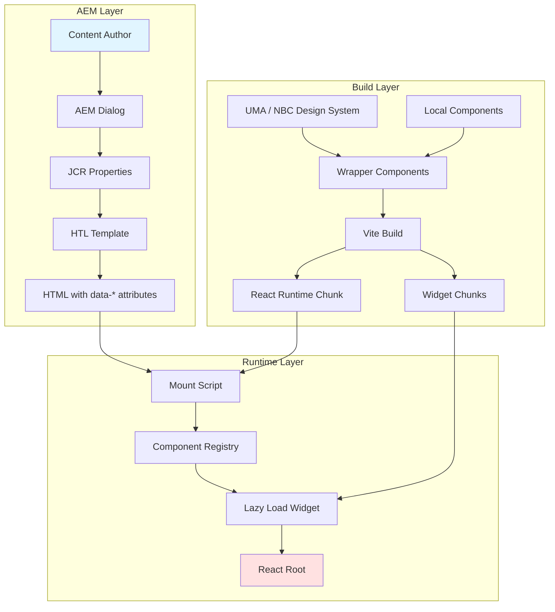
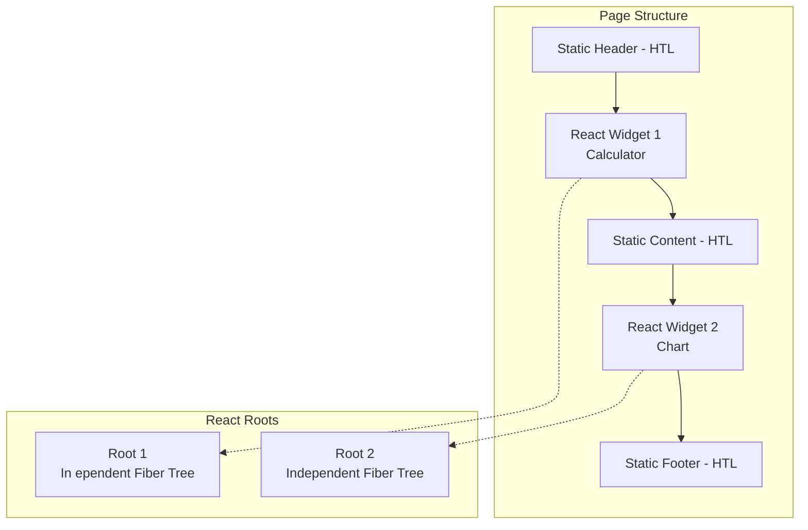
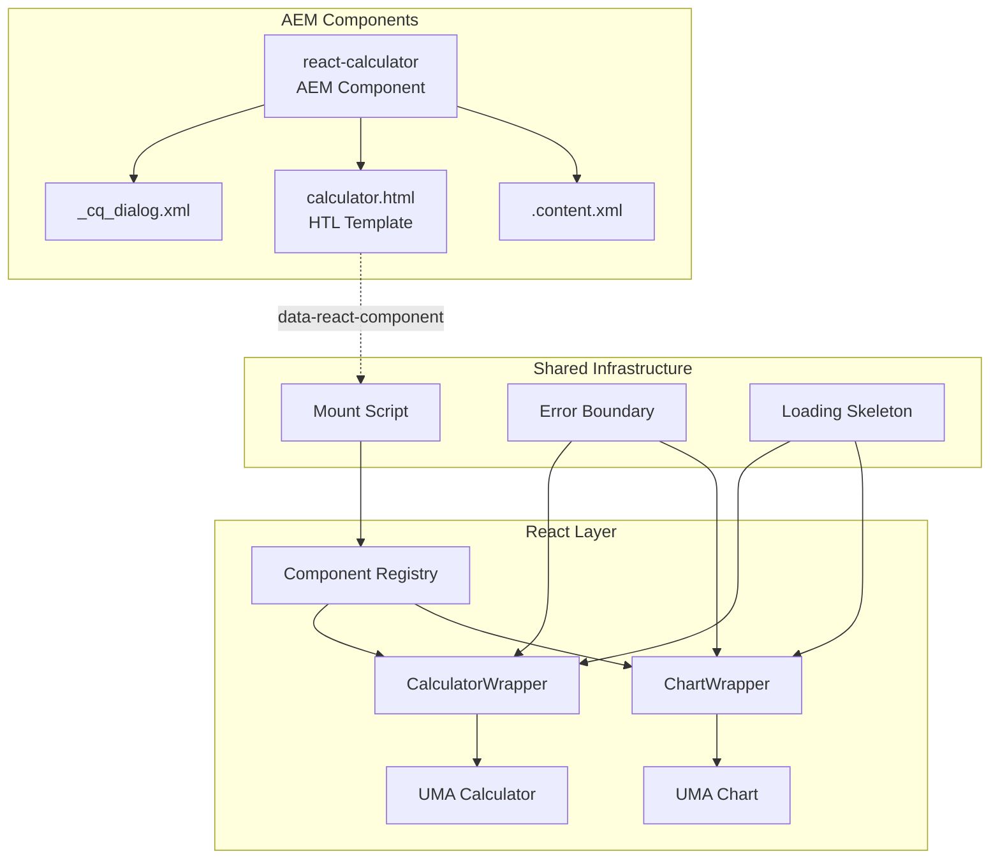
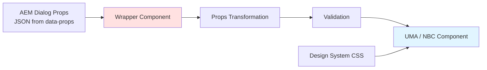
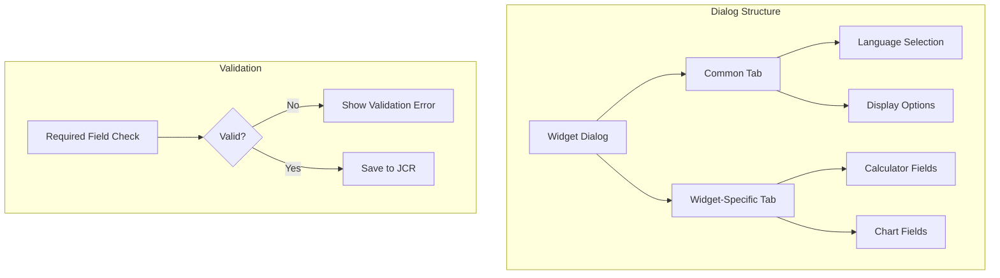
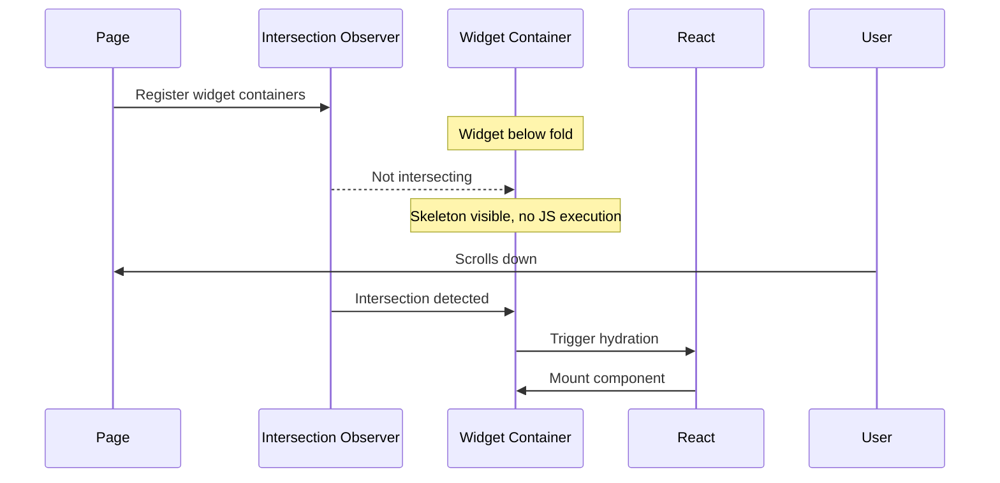
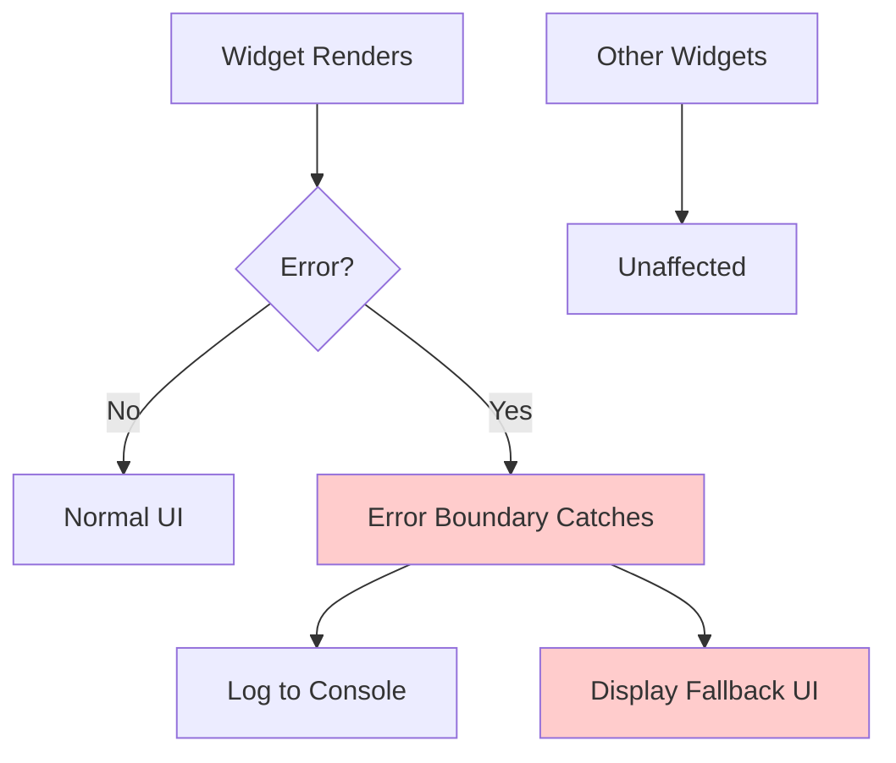

# Design Document: React.js Integration with AEM as a Cloud Service

## Overview

This design document presents the architectural strategy for integrating React.js components into Adobe Experience Manager as a Cloud Service (AEMaaCS) using a hybrid "Islands Architecture" approach. The solution enables interactive widgets—calculators and data visualizations with filters—to be embedded within server-rendered AEM pages while preserving AEM's content management capabilities.

### Design Principles

1. **Sling/HTL as Primary**: AEM maintains control of page rendering; React serves as the Widget Engine
2. **Widget Isolation**: Each React widget operates independently with its own root and error boundary
3. **Optimal Loading**: Only JavaScript for widgets present on the page is downloaded
4. **Author Empowerment**: Content authors configure widgets through familiar AEM dialogs
5. **Design System Integration**: Leverage existing organizational React components (UMA, NBC Design System) through wrapper pattern

## Glossary

| Term | Definition |
|------|------------|
| **AEM** | Adobe Experience Manager - enterprise content management system |
| **AEMaaCS** | AEM as a Cloud Service - cloud-native version of AEM |
| **Clientlib** | Client Library - AEM's mechanism for managing CSS/JS assets with dependency management |
| **CLS** | Cumulative Layout Shift - Core Web Vital metric measuring visual stability |
| **Design System** | Shared component library (UMA or NBC Design System) providing consistent UI elements |
| **HTL** | HTML Template Language - AEM's server-side templating language (formerly Sightly) |
| **Hydration** | Process of attaching JavaScript event handlers to server-rendered HTML |
| **Islands Architecture** | Hybrid rendering pattern with static HTML and interactive "islands" of JavaScript |
| **JCR** | Java Content Repository - hierarchical content storage in AEM |
| **Multi-Root Mounting** | Pattern where multiple independent React applications mount at specific DOM locations |
| **NBC Design System** | Organization's design system package containing React components, styles, and tokens |
| **Sling** | Apache Sling - RESTful web framework underlying AEM |
| **TTI** | Time to Interactive - performance metric measuring when page becomes fully interactive |
| **UMA** | Unified Module Assembler - organization's internal React component library |
| **WCM Mode** | Web Content Management Mode - AEM's authoring state (edit, preview, disabled/published) |
| **Widget** | Self-contained React component providing interactive functionality within a page |
| **Widget Container** | HTML element (`<div>`) that serves as the mounting point for a React widget |
| **Widget Engine** | The React runtime and mount script that discovers and initializes widgets on a page |
| **Wrapper Component** | React component that adapts design system components for AEM consumption |

### References

- [React 18 createRoot API](https://react.dev/reference/react-dom/client/createRoot)
- [Vite Build Tool](https://vitejs.dev/)
- [aem-clientlib-generator](https://www.npmjs.com/package/aem-clientlib-generator)
- [fast-check Property Testing](https://fast-check.dev/)
- [Islands Architecture (patterns.dev)](https://www.patterns.dev/posts/islands-architecture)

### Key Decisions Summary

| Decision | Choice | Rationale |
|----------|--------|-----------|
| Mounting Strategy | Multi-Root | Fault isolation, independent lazy loading, natural AEM component mapping |
| Build Tool | Vite | Faster builds, native ESM, better code splitting, modern DX |
| State Management | None (isolated widgets) | Widgets are independent; no cross-widget communication required |
| Clientlib Strategy | Shared runtime + per-widget chunks | Optimal caching, minimal page weight |

## Architecture

### High-Level Architecture

The integration follows a layered architecture where AEM components wrap React widgets, providing configuration through dialogs and rendering mount points via HTL templates.



### Multi-Root Mounting Strategy

The Multi-Root pattern creates independent React application instances for each widget on a page. This approach was selected over alternatives (Portals, Single SPA) based on the following analysis:



#### Decision Matrix: Mounting Strategies

| Criteria | Multi-Root | Portals | Single SPA |
|----------|------------|---------|------------|
| **Fault Isolation** | ✅ Excellent | ❌ Single point of failure | ⚠️ Partial |
| **Lazy Loading** | ✅ Per-widget | ⚠️ Complex | ⚠️ Per-app |
| **AEM Integration** | ✅ Natural fit | ⚠️ Hidden root needed | ❌ Complex |
| **Shared Context** | ❌ Not supported | ✅ Full support | ⚠️ Via events |
| **Bundle Size** | ✅ Optimal | ⚠️ All widgets loaded | ❌ Framework overhead |
| **Complexity** | ✅ Low | ⚠️ Medium | ❌ High |

**Selected: Multi-Root** — Best fit for independent widgets with no cross-communication requirement.

#### Why Not Portals?

React Portals allow rendering into different DOM locations while maintaining shared context. However:
- **Single Point of Failure**: An error in any widget crashes all widgets
- **Hidden Root Required**: Needs an invisible root element, complicating HTL templates
- **Unnecessary Complexity**: Shared context is not needed for independent calculators/charts
- **Bundle Loading**: All portal-rendered components typically load together

#### Why Not Single SPA?

Single SPA is designed for micro-frontend orchestration but:
- **Overhead**: Adds framework weight for simple widget integration
- **Complexity**: Requires lifecycle management beyond our needs
- **Overkill**: Designed for full application composition, not widget embedding

## Components and Interfaces

### Component Architecture



### Interface Definitions

#### Widget Container Contract (HTML)

The widget container is the HTML element where React mounts a widget. It uses data attributes to specify the component type and configuration.

```html
<div class="react-widget"
     data-react-component="CalculatorWidget"
     data-props='{"type":"mortgage","language":"en","labels":{...}}'>
    <!-- Loading skeleton rendered by HTL -->
    <div class="widget-skeleton">...</div>
</div>
```

#### Component Registry Interface

```typescript
interface ComponentRegistry {
  [componentName: string]: React.LazyExoticComponent<React.ComponentType<any>>;
}

// Registry maps string identifiers to lazy-loaded components
const registry: ComponentRegistry = {
  'CalculatorWidget': lazy(() => import('./widgets/CalculatorWrapper')),
  'ChartWidget': lazy(() => import('./widgets/ChartWrapper')),
};
```

#### Wrapper Component Interface

```typescript
interface WrapperProps {
  // Props from AEM dialog, parsed from data-props
  [key: string]: unknown;
}

interface UMAComponentProps {
  // Props expected by UMA component
  // Wrapper transforms WrapperProps to UMAComponentProps
}
```

#### Widget Engine (Mount Script)

The Widget Engine is the core JavaScript module responsible for discovering and initializing React widgets on the page. It is bundled into the React runtime clientlib and executes automatically when the DOM is ready.

**Widget Engine Lifecycle:**
1. Clientlib loads → Widget Engine registers DOMContentLoaded listener
2. DOM ready → `initializeWidgets()` discovers all widget containers (`[data-react-component]` elements)
3. For each widget container → Lazy load the widget chunk and create a React root
4. Page navigation → `unmountAllWidgets()` cleans up all roots

**Multiple Instances of Same Component:**
When the same component type appears multiple times on a page (e.g., two Calculator widgets), each widget container gets its own independent React root. The `activeRoots` Map uses the DOM element itself as the key, ensuring uniqueness even when `data-react-component` values are identical.

```typescript
// mount.ts - Widget Engine included in React runtime clientlib

// Track active roots for cleanup - keyed by widget container (unique per instance)
const activeRoots = new Map<HTMLElement, Root>();

/** Initialize all widgets found on page */
function initializeWidgets(): void {
  const containers = document.querySelectorAll('[data-react-component]');
  // Each widget container gets its own root, even if component type is the same
  containers.forEach(container => mountWidget(container as HTMLElement));
}

/** Mount a single widget - creates unique root per widget container */
function mountWidget(container: HTMLElement): void {
  // Skip if already mounted (prevents duplicate roots)
  if (activeRoots.has(container)) {
    console.warn('Widget already mounted:', container);
    return;
  }
  
  const componentName = container.dataset.reactComponent;
  const propsJson = container.dataset.props || '{}';
  
  // Parse props, lookup component in registry...
  const Component = registry[componentName];
  if (!Component) {
    console.warn(`Component "${componentName}" not found in registry`);
    return;
  }
  
  // Create unique root for this widget container
  const root = createRoot(container);
  root.render(
    <Suspense fallback={<WidgetSkeleton />}>
      <ErrorBoundary>
        <Component {...JSON.parse(propsJson)} />
      </ErrorBoundary>
    </Suspense>
  );
  
  // Track root using widget container as key (guarantees uniqueness)
  activeRoots.set(container, root);
}

/** Unmount all React roots (call before page navigation) */
function unmountAllWidgets(): void {
  activeRoots.forEach((root, container) => {
    root.unmount();
  });
  activeRoots.clear();
}

/** Mount widgets in a specific container (for dynamic content) */
function mountWidgetsInContainer(parentElement: HTMLElement): void {
  const containers = parentElement.querySelectorAll('[data-react-component]');
  containers.forEach(container => mountWidget(container as HTMLElement));
}

// Auto-initialize on DOM ready
document.addEventListener('DOMContentLoaded', initializeWidgets);

// Expose API globally for programmatic use
window.ReactWidgets = {
  initializeWidgets,
  mountWidget,
  unmountAllWidgets,
  mountWidgetsInContainer,
  getActiveRoots: () => activeRoots,
};
```

**Example: Two Calculators on Same Page**
```html
<!-- Both use same component type, but each gets its own React root -->
<div class="react-widget" 
     data-react-component="CalculatorWidget"
     data-props='{"type":"mortgage","language":"en"}'>
</div>

<div class="react-widget"
     data-react-component="CalculatorWidget" 
     data-props='{"type":"loan","language":"fr"}'>
</div>
```

Each widget container is a unique DOM node, so `activeRoots.set(container, root)` creates two separate entries in the Map. The widgets operate completely independently.

**Programmatic Mounting**: When widget containers are dynamically added to the page (e.g., via AEM's Experience Fragments or client-side rendering), developers can call `window.ReactWidgets.mountWidgetsInContainer(parentElement)` to initialize widgets within that region.

### AEM Component Folder Structure

Each React widget AEM component follows a standardized folder structure:

```
ui.apps/src/main/content/jcr_root/apps/myproject/components/
└── react-calculator/
    ├── .content.xml              # Component definition
    ├── _cq_dialog/
    │   └── .content.xml          # Touch UI dialog
    ├── _cq_editConfig.xml        # Edit configuration (optional)
    └── calculator.html           # HTL template
```

#### Naming Conventions

| Element | Convention | Example |
|---------|------------|---------|
| Component folder | `react-{widget-name}` | `react-calculator` |
| HTL file | `{widget-name}.html` | `calculator.html` |
| Component group | `My Project - React` | Isolates from classical components |
| Component title | `React {Widget Name}` | `React Calculator` |

**Design Decision**: Prefix component folders with `react-` to clearly distinguish React-based components from traditional AEM components in the component browser.

### Component Wrapper Pattern (UMA / NBC Design System)

Wrappers serve as adapters between AEM dialog configuration and design system component expectations. **UMA components** and **NBC Design System** are the most frequently imported dependencies in our React widgets—the integration approach is identical for both.



**Wrapper Responsibilities:**
1. Parse and validate props from AEM
2. Transform prop names/structures to design system component expectations
3. Handle language/i18n configuration
4. Provide error boundary wrapping
5. Apply any AEM-specific styling adjustments

**Design Decision**: The wrapper pattern is agnostic to the source component library. Whether using UMA or NBC Design System components, the wrapper provides the same abstraction layer between AEM and React.

## Data Models

### AEM Dialog Configuration Model

```typescript
interface WidgetDialogConfig {
  // Common properties for all widgets
  componentType: string;      // Maps to registry key
  language: string;           // ISO language code (en, fr, de)
  
  // Widget-specific properties (varies by widget type)
  [key: string]: unknown;
}

// Example: Calculator widget config
interface CalculatorConfig extends WidgetDialogConfig {
  calculatorType: 'mortgage' | 'loan' | 'savings';
  defaultValues?: {
    principal?: number;
    rate?: number;
    term?: number;
  };
  labels?: {
    title?: string;
    submitButton?: string;
  };
}

// Example: Chart widget config
interface ChartConfig extends WidgetDialogConfig {
  chartType: 'bar' | 'line' | 'pie';
  dataEndpoint?: string;      // REST API for dynamic data
  staticData?: ChartDataPoint[];
  filterOptions?: FilterConfig[];
}
```

### Runtime State Model

```typescript
interface WidgetRuntimeState {
  // Tracked by mount script
  activeRoots: Map<HTMLElement, Root>;
  
  // Per-widget state (internal to each widget)
  // No shared state between widgets
}
```

### Clientlib Category Model

Clientlib categories follow a naming convention that isolates React components from classical AEM components:

```typescript
interface ClientlibCategories {
  // React runtime (React, ReactDOM, mount script, Design System CSS)
  runtime: 'myproject.react.runtime';
  
  // Widget-specific clientlibs
  widgets: {
    calculator: 'myproject.react.widget.calculator';
    chart: 'myproject.react.widget.chart';
  };
  
  // Classical AEM components (separate namespace)
  classical: 'myproject.components';
}
```

**Category Naming Convention**:
- `{project}.react.runtime` - Shared React runtime
- `{project}.react.widget.{name}` - Widget-specific chunks
- `{project}.components` - Classical AEM components

**Design Decision**: Use `.react.` namespace segment to clearly separate React clientlibs from classical AEM clientlibs, preventing accidental inclusion and enabling targeted cache invalidation.

### Vite Build Configuration

The Vite build outputs JavaScript and CSS files that are then converted to AEM clientlibs using `aem-clientlib-generator`.

```typescript
// vite.config.ts
import { defineConfig } from 'vite';
import react from '@vitejs/plugin-react';

export default defineConfig({
  build: {
    outDir: 'dist',
    rollupOptions: {
      input: {
        // Main entry point includes mount script
        main: 'src/main.tsx',
      },
      output: {
        // Extract React into shared vendor chunk
        manualChunks: {
          'react-vendor': ['react', 'react-dom'],
          'design-system': ['@nbc/design-system'],  // or UMA package
        },
        // Output structure for aem-clientlib-generator
        entryFileNames: 'js/[name].js',
        chunkFileNames: 'js/chunks/[name].[hash].js',
        assetFileNames: 'resources/[name].[hash][extname]',
      },
    },
    // Generate manifest.json for clientlib mapping
    manifest: true,
  },
  plugins: [
    react({
      // Enable Fast Refresh for development
      fastRefresh: true,
    }),
  ],
});
```

### AEM Clientlib Generation

After Vite builds the assets, `aem-clientlib-generator` converts them to AEM clientlib format:

```javascript
// clientlib.config.js
module.exports = {
  context: __dirname,
  clientLibRoot: '../ui.apps/src/main/content/jcr_root/apps/myproject/clientlibs',
  libs: [
    {
      name: 'clientlib-react-runtime',
      categories: ['myproject.react.runtime'],
      serializationFormat: 'xml',
      assets: {
        js: ['dist/js/main.js', 'dist/js/chunks/react-vendor.*.js'],
        css: ['dist/resources/*.css'],
      },
    },
    {
      name: 'clientlib-react-calculator',
      categories: ['myproject.react.widget.calculator'],
      dependencies: ['myproject.react.runtime'],
      serializationFormat: 'xml',
      assets: {
        js: ['dist/js/chunks/CalculatorWrapper.*.js'],
      },
    },
    {
      name: 'clientlib-react-chart',
      categories: ['myproject.react.widget.chart'],
      dependencies: ['myproject.react.runtime'],
      serializationFormat: 'xml',
      assets: {
        js: ['dist/js/chunks/ChartWrapper.*.js'],
      },
    },
  ],
};
```

**Build Pipeline:**
1. `npm run build` → Vite compiles React code to `dist/`
2. `npm run clientlib` → aem-clientlib-generator creates AEM clientlibs
3. Maven build → Packages clientlibs into ui.apps

**Design Decision**: Use `aem-clientlib-generator` to bridge Vite output with AEM's clientlib system, maintaining compatibility with existing AEM build pipelines.

## Correctness Properties

*A property is a characteristic or behavior that should hold true across all valid executions of a system—essentially, a formal statement about what the system should do. Properties serve as the bridge between human-readable specifications and machine-verifiable correctness guarantees.*

These properties define the key invariants that the implementation must maintain. They are used to guide property-based testing, where random inputs are generated to verify these rules hold in all cases. Each property maps back to specific acceptance criteria from the requirements document.

Based on the acceptance criteria analysis, the following correctness properties must be maintained:

### Property 1: Widget Discovery Completeness
*For any* page containing N elements with `data-react-component` attributes, the Widget Engine SHALL discover exactly N widget containers and attempt to create N React roots.
**Validates: Requirements 1.1, 1.3**

### Property 2: Error Isolation
*For any* React widget that throws a runtime error, all other widgets on the same page SHALL continue to function normally without re-rendering or state loss.
**Validates: Requirements 1.2, 7.1**

### Property 3: Props Round-Trip Consistency
*For any* valid widget configuration object, serializing to JSON (for data-props attribute) and parsing back SHALL produce an equivalent configuration object.
**Validates: Requirements 1.4, 4.2**

### Property 4: Invalid Props Graceful Handling
*For any* malformed JSON in the data-props attribute, the mount script SHALL log an error and skip that widget without blocking other widgets from mounting.
**Validates: Requirements 1.5, 7.3**

### Property 5: Runtime Singleton
*For any* page with multiple React widgets, the React and ReactDOM libraries SHALL be loaded exactly once and shared across all widget roots.
**Validates: Requirements 6.3**

### Property 6: Root Tracking Consistency
*For any* sequence of mount and unmount operations, the active roots collection SHALL accurately reflect the current state of mounted widgets.
**Validates: Requirements 8.2, 8.4**

### Property 7: Cleanup Execution
*For any* mounted widget with useEffect cleanup functions, calling unmount on its root SHALL trigger all cleanup functions before the root is destroyed.
**Validates: Requirements 8.3**

### Property 8: Wrapper Props Transformation
*For any* valid AEM dialog configuration, the wrapper component SHALL transform props to a valid UMA component props structure without data loss, including language code propagation.
**Validates: Requirements 3.4, 3.5**

### Property 9: Lazy Hydration Deferred Mounting
*For any* widget container with `data-lazy-hydrate="true"` that is not visible in the viewport, the Widget Engine SHALL NOT create a React root until the container intersects with the viewport.
**Validates: Requirements 10.1**

### Property 10: Layout Shift Prevention
*For any* widget container, the CSS SHALL include a minimum height value to reserve space and prevent Cumulative Layout Shift during widget loading.
**Validates: Requirements 10.2, 10.4**

### Property 11: Main Thread Non-Blocking
*For any* page with multiple widgets initializing simultaneously, the Widget Engine SHALL yield to the browser between widget batches to prevent long tasks that block the main thread.
**Validates: Requirements 10.5**

## Author Experience

### Dialog Design Pattern

Content authors configure React widgets through AEM Touch UI dialogs. Each widget type defines its own dialog with widget-specific fields.



#### Common Dialog Fields (Examples)

React widget dialogs may include fields such as:
- **Language Selection**: Dropdown with supported language codes (en, fr, de, etc.)
- **Widget Title**: Override for widget heading
- **CSS Class**: Additional styling classes
- **Theme Variant**: Light/dark mode selection

These are examples; actual fields depend on widget requirements. No fields are universally required across all widgets.

#### Widget-Specific Fields

| Widget Type | Fields | Input Types |
|-------------|--------|-------------|
| Calculator | Calculator type, default values, labels | Select, Number, Textfield |
| Chart | Chart type, data source, filter options | Select, Pathfield, Multifield |

#### Unconfigured Widget Placeholder

When a widget is added but not configured, the HTL template renders a placeholder:

```html
<div class="react-widget react-widget--unconfigured"
     data-react-component="${properties.componentType}"
     data-props='{}'>
    <div class="widget-placeholder">
        <span class="widget-placeholder__icon">⚙️</span>
        <span class="widget-placeholder__message">Configure this widget</span>
    </div>
</div>
```

**Design Decision**: Placeholder is rendered server-side via HTL, not by React, ensuring authors see feedback even if JavaScript fails to load.

### Dialog Validation

Dialogs enforce validation rules:
1. **Required fields**: Prevent save if missing
2. **Type validation**: Ensure numeric fields contain valid numbers
3. **Range validation**: Enforce min/max values where applicable

Validation feedback appears inline next to invalid fields using Coral UI validation patterns.

### AEM Author Mode Detection

React widgets behave differently depending on the AEM authoring mode to ensure a smooth authoring experience while providing full functionality to end users.

#### Mode-Based Widget Behavior

| Mode | Widget Behavior | Rationale |
|------|-----------------|-----------|
| **Edit Mode** | Static placeholder with configuration summary | Prevents interactive elements from interfering with authoring tools |
| **Preview Mode** | Fully functional widget | Authors can test widget behavior before publishing |
| **Published Page** | Fully functional widget | End-user experience |

#### Implementation

The mount script detects AEM's WCM mode and adjusts widget rendering accordingly:

```typescript
// Detect AEM authoring mode
function getWCMMode(): 'edit' | 'preview' | 'disabled' {
  // AEM sets this on the documentElement or body
  const wcmMode = document.documentElement.dataset.wcmmode 
    || document.body.dataset.wcmmode
    || 'disabled'; // 'disabled' means published/production
  
  return wcmMode as 'edit' | 'preview' | 'disabled';
}

function mountWidget(container: HTMLElement): void {
  const wcmMode = getWCMMode();
  
  // In edit mode, render a static placeholder instead of the interactive widget
  if (wcmMode === 'edit') {
    renderEditModePlaceholder(container);
    return;
  }
  
  // In preview and published modes, render the full widget
  // ... normal mounting logic
}

function renderEditModePlaceholder(container: HTMLElement): void {
  const componentName = container.dataset.reactComponent;
  const props = JSON.parse(container.dataset.props || '{}');
  
  container.innerHTML = `
    <div class="react-widget-edit-placeholder">
      <div class="react-widget-edit-placeholder__header">
        <span class="react-widget-edit-placeholder__icon">⚛️</span>
        <span class="react-widget-edit-placeholder__name">${componentName}</span>
      </div>
      <div class="react-widget-edit-placeholder__config">
        ${Object.entries(props).map(([key, value]) => 
          `<div><strong>${key}:</strong> ${JSON.stringify(value)}</div>`
        ).join('')}
      </div>
    </div>
  `;
}
```

#### HTL Template Support

The HTL template can also conditionally render based on WCM mode:

```html
<sly data-sly-test="${wcmmode.edit}">
    <!-- Edit mode: show configuration summary -->
    <div class="react-widget react-widget--edit-mode"
         data-react-component="${properties.componentType}">
        <div class="widget-edit-placeholder">
            <p>Widget: ${properties.componentType}</p>
            <p>Language: ${properties.language}</p>
        </div>
    </div>
</sly>
<sly data-sly-test="${!wcmmode.edit}">
    <!-- Preview/Publish: render full widget -->
    <div class="react-widget"
         data-react-component="${properties.componentType}"
         data-props='${propsJson}'>
    </div>
</sly>
```

**Design Decision**: Use both HTL-level and JavaScript-level mode detection for defense in depth. HTL handles the initial render, while JavaScript provides a fallback if the mode changes dynamically.

## Performance Optimization

### Lazy Hydration Strategy

Widgets below the fold use Intersection Observer for deferred hydration, improving initial page load performance.



#### Implementation

```typescript
interface LazyHydrationConfig {
  rootMargin: string;      // Default: '200px' (preload slightly before visible)
  threshold: number;       // Default: 0 (any intersection triggers)
}

// Mount script checks for data-lazy-hydrate attribute
<div class="react-widget"
     data-react-component="ChartWidget"
     data-props='{...}'
     data-lazy-hydrate="true">
```

**Design Decision**: Lazy hydration is opt-in via `data-lazy-hydrate` attribute. Critical above-the-fold widgets mount immediately.

### Cumulative Layout Shift Prevention

Widget containers reserve space to prevent layout shifts during loading:

```css
.react-widget {
  /* Minimum height prevents CLS */
  min-height: var(--widget-min-height, 200px);
  
  /* Skeleton maintains visual stability */
  .widget-skeleton {
    height: 100%;
    background: linear-gradient(90deg, #f0f0f0 25%, #e0e0e0 50%, #f0f0f0 75%);
    background-size: 200% 100%;
    animation: skeleton-pulse 1.5s ease-in-out infinite;
  }
}

@keyframes skeleton-pulse {
  0% { background-position: 200% 0; }
  100% { background-position: -200% 0; }
}
```

Widget-specific minimum heights can be configured via CSS custom properties or inline styles from AEM dialog.

### Main Thread Optimization

To prevent blocking the main thread during widget initialization:

1. **Chunked Initialization**: Widgets mount in batches using `requestIdleCallback`
2. **Priority Queue**: Above-fold widgets mount first
3. **Yield to Browser**: Long tasks are broken up to maintain responsiveness

```typescript
async function initializeWidgetsNonBlocking(containers: HTMLElement[]): Promise<void> {
  const BATCH_SIZE = 3;
  
  for (let i = 0; i < containers.length; i += BATCH_SIZE) {
    const batch = containers.slice(i, i + BATCH_SIZE);
    await Promise.all(batch.map(mountWidget));
    
    // Yield to browser between batches
    await new Promise(resolve => requestIdleCallback(resolve));
  }
}
```

**Design Decision**: Use `requestIdleCallback` with fallback to `setTimeout` for Safari compatibility.

## Analytics Integration

Each React widget is responsible for pushing analytics data to the Adobe Data Layer. The data layer object name is configurable in AEM and may vary between environments, so it should be passed as a prop to each widget.

### Data Layer Configuration

```typescript
interface AnalyticsProps {
  // Data layer object name (configurable in AEM, defaults to 'adobeDataLayer')
  dataLayerName?: string;
}

// Widget receives dataLayerName from AEM dialog
interface CalculatorWidgetProps extends AnalyticsProps {
  type: 'mortgage' | 'loan' | 'savings';
  language: string;
}
```

### Pushing Events to Data Layer

```typescript
// Utility function for pushing analytics events
function pushToDataLayer(dataLayerName: string, event: object): void {
  const dataLayer = (window as any)[dataLayerName];
  if (dataLayer && typeof dataLayer.push === 'function') {
    dataLayer.push(event);
  } else {
    console.warn(`Data layer "${dataLayerName}" not found`);
  }
}

// Usage in widget
const CalculatorWidget: React.FC<CalculatorWidgetProps> = ({ 
  type, 
  language, 
  dataLayerName = 'adobeDataLayer' 
}) => {
  const handleCalculation = (result: number) => {
    pushToDataLayer(dataLayerName, {
      event: 'calculator-result',
      calculator: {
        type,
        result,
        language,
      },
    });
  };
  
  // ... widget implementation
};
```

### AEM Dialog Configuration

The data layer name is configured in the widget's AEM dialog, allowing authors or administrators to specify the correct data layer for each environment:

```xml
<dataLayerName
    jcr:primaryType="nt:unstructured"
    sling:resourceType="granite/ui/components/coral/foundation/form/textfield"
    fieldLabel="Data Layer Name"
    name="./dataLayerName"
    value="adobeDataLayer"/>
```

**Design Decision**: Pass `dataLayerName` as a prop rather than hardcoding, enabling flexibility across different AEM configurations and environments where the data layer name may differ.

## Error Handling

### Error Boundary Strategy

Each widget is wrapped in an Error Boundary that:
1. Catches rendering errors within the widget
2. Displays a fallback UI (configurable per widget)
3. Logs error details to console
4. Prevents error propagation to other widgets



### Error Scenarios and Handling

| Scenario | Handler | Behavior |
|----------|---------|----------|
| Invalid component name | Mount Script | Log warning, skip widget |
| Malformed JSON props | Mount Script | Log error, skip widget |
| Widget render error | Error Boundary | Show fallback, log error |
| Chunk load failure | Suspense + Error Boundary | Show error state with retry option |
| UMA component error | Error Boundary | Show fallback, log error |

### Chunk Load Failure Handling

When a widget chunk fails to load (network error, 404, etc.), the system provides graceful degradation:

```typescript
// Suspense error boundary wrapper for chunk loading
const ChunkErrorBoundary: React.FC<{ children: React.ReactNode }> = ({ children }) => {
  return (
    <ErrorBoundary
      fallback={({ error, resetErrorBoundary }) => (
        <div className="widget-chunk-error">
          <p>Failed to load widget</p>
          <button onClick={resetErrorBoundary}>Retry</button>
        </div>
      )}
    >
      <Suspense fallback={<WidgetSkeleton />}>
        {children}
      </Suspense>
    </ErrorBoundary>
  );
};
```

**Design Decision**: Chunk load failures show a retry button rather than silent failure, giving users the option to recover from transient network issues.

### Fallback UI Options

Widgets can configure fallback behavior:
1. **Silent**: Hide the widget container entirely
2. **Message**: Display a user-friendly error message
3. **Retry**: Show a "Try Again" button to re-mount
4. **Custom**: Widget-specific fallback component

**Recommendation**: Use "Message" as default with option to customize per widget type.

## Testing Strategy

### Dual Testing Approach

The testing strategy combines unit tests for specific behaviors with property-based tests for universal correctness guarantees.

#### Property-Based Testing

**Framework**: fast-check (JavaScript property-based testing library, integrates with Jest)

Property tests will verify the correctness properties defined above by generating random inputs and checking invariants hold across all cases.

**Configuration**: Each property test runs minimum 100 iterations.

**Test Annotation Format**: Each test includes a comment linking to the design property:
```javascript
// **Feature: react-aem-integration, Property 3: Props Round-Trip Consistency**
```

#### Unit Testing

**Framework**: Jest (existing project standard)

Since Jest is already used in the project, we'll continue using it for unit tests. fast-check integrates seamlessly with Jest for property-based tests.

Unit tests cover:
- Specific edge cases (empty props, missing attributes)
- Integration points (registry lookup, wrapper transformation)
- Error boundary behavior with known error types

```javascript
// Example Jest + fast-check integration
import * as fc from 'fast-check';

describe('Props Round-Trip', () => {
  // **Feature: react-aem-integration, Property 3: Props Round-Trip Consistency**
  it('should preserve config through JSON serialization', () => {
    fc.assert(
      fc.property(fc.jsonValue(), (config) => {
        const serialized = JSON.stringify(config);
        const parsed = JSON.parse(serialized);
        expect(parsed).toEqual(config);
      }),
      { numRuns: 100 }
    );
  });
});
```

#### Integration Testing

**Framework**: Cypress (existing organizational standard)

Integration tests verify:
- End-to-end widget mounting on AEM pages
- Author dialog configuration flow
- Widget interaction behavior

### Test Organization

```
ui.frontend.react/
├── src/
│   ├── widgets/
│   │   ├── CalculatorWrapper.tsx
│   │   └── CalculatorWrapper.test.ts    # Jest unit tests
│   ├── core/
│   │   ├── mount.ts
│   │   ├── mount.test.ts                # Jest unit tests
│   │   ├── lazy-hydration.ts
│   │   └── lazy-hydration.test.ts       # Jest unit tests
│   └── __tests__/
│       └── properties/
│           ├── discovery.property.test.ts      # Property 1 (Jest + fast-check)
│           ├── isolation.property.test.ts      # Property 2
│           ├── roundtrip.property.test.ts      # Property 3
│           ├── invalid-props.property.test.ts  # Property 4
│           ├── singleton.property.test.ts      # Property 5
│           ├── root-tracking.property.test.ts  # Property 6
│           ├── cleanup.property.test.ts        # Property 7
│           ├── wrapper-transform.property.test.ts  # Property 8
│           ├── lazy-hydration.property.test.ts # Property 9
│           ├── layout-shift.property.test.ts   # Property 10
│           └── main-thread.property.test.ts    # Property 11
├── jest.config.js                       # Jest configuration
└── package.json
```

### Property Test Coverage Matrix

| Property | Test File | Key Generators |
|----------|-----------|----------------|
| 1. Widget Discovery | discovery.property.test.ts | Random DOM with N widget containers |
| 2. Error Isolation | isolation.property.test.ts | Widgets with injected errors |
| 3. Props Round-Trip | roundtrip.property.test.ts | Random valid config objects |
| 4. Invalid Props | invalid-props.property.test.ts | Malformed JSON strings |
| 5. Runtime Singleton | singleton.property.test.ts | Pages with varying widget counts |
| 6. Root Tracking | root-tracking.property.test.ts | Mount/unmount operation sequences |
| 7. Cleanup Execution | cleanup.property.test.ts | Widgets with useEffect cleanups |
| 8. Wrapper Transform | wrapper-transform.property.test.ts | AEM dialog config objects |
| 9. Lazy Hydration | lazy-hydration.property.test.ts | Viewport intersection states |
| 10. Layout Shift | layout-shift.property.test.ts | Widget container styles |
| 11. Main Thread | main-thread.property.test.ts | Concurrent widget initialization |
