# React.js Integration with Adobe Experience Manager
## Comprehensive Architectural Documentation

---

## Executive Summary

This document presents a comprehensive architectural strategy for integrating React.js components into Adobe Experience Manager (AEM) as interactive widgets within server-rendered pages. The approach prioritizes **Apache Sling and HTL as the primary rendering technology** while leveraging **React.js for specific interactive enhancements** that would be complex or inefficient to implement with traditional AEM components.

### Key Architectural Decisions

1. **Hybrid Architecture**: AEM/Sling maintains control of page rendering and content management, while React serves as an enhancement layer for interactive widgets
2. **Multi-Root Mounting Strategy**: Multiple independent React applications mounted at specific DOM locations, enabling isolation and fault tolerance
3. **Component Wrapping Pattern**: React widgets wrapped in AEM components, enabling configuration through standard AEM dialogs
4. **Build Tool Migration**: Transition from Webpack to Vite for improved developer experience and build performance
5. **Framework Abstraction**: Custom integration framework to standardize mounting, configuration, and lifecycle management

### Business Value

- **Incremental Modernization**: Enhance existing AEM pages without full rewrites
- **Developer Productivity**: Modern React tooling for interactive features while preserving AEM's content management strengths
- **Performance Optimization**: Server-side rendering for content with selective client-side interactivity
- **Maintainability**: Clear separation of concerns and standardized integration patterns

---

## 1. Technology Overview and Integration Challenges

### 1.1 Core Technologies

#### Apache Sling
Apache Sling is the foundation of AEM's content delivery mechanism. It provides:
- **RESTful content resolution**: Maps HTTP requests to JCR content nodes
- **Server-side rendering**: Processes HTL templates on the server before sending HTML to the client
- **Component-based architecture**: Reusable, configurable components managed through AEM authoring
- **Native integration**: Deep integration with AEM's authoring, workflow, and publishing systems

#### HTL (HTML Template Language)
HTL is AEM's declarative templating language, offering:
- **Security by design**: Automatic XSS protection and output escaping
- **Content-first approach**: Optimized for content-driven websites
- **Server-side execution**: Templates rendered server-side, producing static HTML
- **Author-friendly**: Templates can be previewed and edited in AEM authoring tools

#### React.js
React is a client-side JavaScript library providing:
- **Component-based UI**: Reusable, composable interface elements
- **Virtual DOM**: Efficient updates and rendering of dynamic content
- **Rich ecosystem**: Extensive libraries for forms, data visualization, state management
- **Client-side interactivity**: Enables complex user interactions without page reloads

### 1.2 Integration Challenges

#### Challenge 1: Rendering Responsibility - Host vs Guest Relationship

**The Core Tension**: Both Sling/HTL and React.js want to control the DOM, but with different paradigms.

```mermaid
graph TB
    subgraph "Traditional AEM (Sling/HTL)"
        A[HTTP Request] --> B[Sling Resolver]
        B --> C[HTL Template]
        C --> D[Complete HTML Page]
        D --> E[Browser]
    end
    
    subgraph "React SPA"
        F[HTTP Request] --> G[Minimal HTML Shell]
        G --> H[Browser Loads React]
        H --> I[React Renders Full UI]
    end
    
    subgraph "Hybrid Architecture"
        J[HTTP Request] --> K[Sling Resolver]
        K --> L[HTL Template with React Placeholders]
        L --> M[HTML + React Mount Points]
        M --> N[Browser]
        N --> O[React Hydrates Specific Widgets]
    end
    
    style A fill:#f9f,stroke:#333
    style F fill:#f9f,stroke:#333
    style J fill:#9f9,stroke:#333
```

**Host vs Guest Definition**:
- **Host (Sling/HTL)**: Controls the page structure, navigation, content rendering, and overall document lifecycle
- **Guest (React)**: Occupies designated "islands" within the page, controlling only specific interactive regions

**Key Conflict**: When the page loads, the HTML from Sling is already rendered. React must mount into existing DOM nodes without disrupting the surrounding static content.

#### Challenge 2: Server-Side vs Client-Side Rendering

**The Rendering Timeline Problem**:

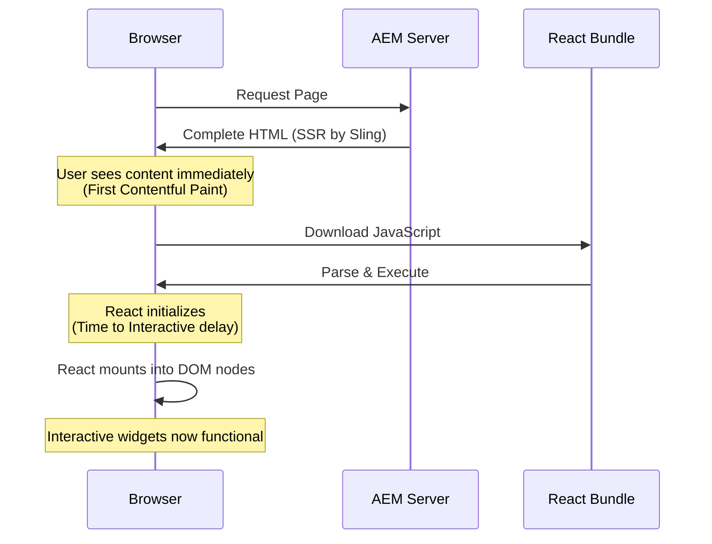

**Challenges**:
1. **Double Rendering**: The server renders HTML, then React potentially re-renders the same content
2. **Layout Shifts**: React mounting can cause visual jumps if not carefully managed
3. **Time to Interactive (TTI)**: Heavy JavaScript bundles delay interactivity
4. **SEO Considerations**: Search engines see server-rendered content but may not execute React

#### Challenge 3: Component Lifecycle Management

**AEM Component Lifecycle** (Server-driven):
1. Author configures component in AEM dialog
2. Configuration saved to JCR
3. HTL template reads configuration from JCR
4. Server renders HTML with configuration applied
5. HTML sent to browser

**React Component Lifecycle** (Client-driven):
1. JavaScript bundle loads in browser
2. Component discovers mount point
3. Component reads configuration from DOM attributes
4. Component initializes state
5. Component renders and attaches event handlers

**Integration Challenge**: Bridging these two lifecycles seamlessly.

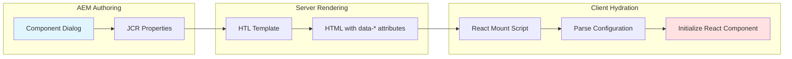

#### Challenge 4: State Management Across Paradigms

**Problem**: In a traditional React SPA, components share state through Context API or state management libraries. In a multi-root hybrid architecture:

- Each React widget has its own isolated root
- React Context doesn't span across roots
- Sling-rendered content is static and stateless on the client
- No native communication channel between AEM components and React widgets

**Example Scenario**: A "Add to Cart" button (React widget) needs to update a "Cart Count" badge (another React widget in the header).

**Solution Requirements**:
- External state management system
- Event-based communication
- Preservation of widget isolation

### 1.3 Technology Comparison Matrix

| Aspect | Apache Sling + HTL | React.js |
|--------|-------------------|----------|
| **Rendering Location** | Server-side | Client-side |
| **Initial Load Performance** | ✅ Excellent - Full HTML immediately | ⚠️ Slower - Requires JS download |
| **SEO Capability** | ✅ Perfect - Crawlers see full content | ⚠️ Requires SSR or pre-rendering |
| **Interactivity** | ❌ Limited - Requires manual JS | ✅ Excellent - Built for interactivity |
| **State Management** | ❌ Page refresh required | ✅ Dynamic updates without reload |
| **Content Authoring** | ✅ Native AEM dialogs | ❌ Requires custom solutions |
| **Learning Curve** | ⚠️ AEM-specific knowledge | ✅ Industry-standard React skills |
| **Component Reusability** | ⚠️ Within AEM only | ✅ Can use npm packages |
| **Development Experience** | ⚠️ Slower iteration cycle | ✅ Hot reload, modern tooling |
| **Bundle Size Impact** | ✅ None - Server-rendered | ⚠️ Adds KB to page weight |
| **Maintenance** | ✅ Stable, well-documented | ⚠️ Ecosystem churn |

---

## 2. Architectural Decision and Strategy

### 2.1 Core Decision: Sling as Primary, React as Enhancement

#### Strategic Rationale

**Decision**: Prioritize Apache Sling/HTL as the primary rendering technology, with React.js serving as a targeted enhancement layer.

**Why Sling/HTL as Primary**:

1. **Native Integration**: Sling is AEM's core technology, providing:
   - Seamless integration with authoring workflows
   - Built-in component configuration through dialogs
   - Content versioning and deployment
   - Multi-site and localization support

2. **Performance Foundation**: Server-side rendering ensures:
   - Fast First Contentful Paint (FCP)
   - Minimal Time to First Byte (TTFB)
   - No JavaScript required for initial content display
   - Excellent Core Web Vitals scores for content-heavy pages

3. **SEO Supremacy**: Static HTML guarantees:
   - Universal crawler compatibility
   - Rich metadata and structured data
   - Social media preview cards work perfectly
   - No hydration or JavaScript execution required for indexing

4. **Content Management**: AEM's strengths lie in:
   - Visual page composition
   - Component configuration through dialogs
   - Workflow and approval processes
   - Digital asset management integration

**When to Use Sling/HTL**:
- Page structure and layout
- Navigation menus and footer
- Article content and text blocks
- Image galleries (non-interactive)
- Forms with simple validation
- SEO-critical content

**Why React as Enhancement**:

1. **Interactive UI Excellence**: React excels at:
   - Real-time data updates (stock tickers, live scores)
   - Complex form wizards with multi-step logic
   - Interactive data visualizations and charts
   - Drag-and-drop interfaces
   - Autocomplete and typeahead search
   - Client-side filtering and sorting

2. **Development Velocity**: React offers:
   - Rich ecosystem of pre-built components
   - Modern tooling (HMR, DevTools)
   - Strong TypeScript support
   - Large talent pool

3. **State Management**: React provides:
   - Efficient handling of complex UI state
   - Optimized re-rendering of only changed elements
   - Built-in hooks for side effects and async operations

**When to Use React**:
- Shopping cart interactions
- Product configurators (e.g., car customization)
- Interactive calculators (mortgage, pricing)
- Live search with instant results
- Comment systems with real-time updates
- Data tables with sorting, filtering, pagination
- Multi-step forms with conditional logic

#### Use Case Decision Matrix

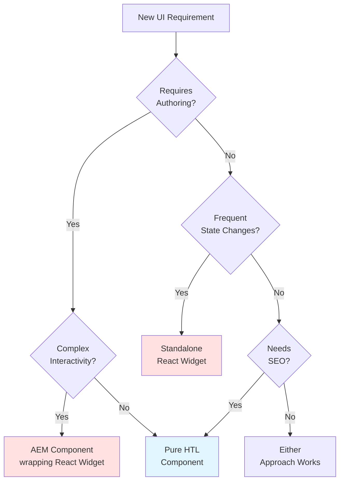

### 2.2 Integration Pattern: React Widgets within AEM Components

#### The Wrapper Pattern

**Concept**: Every React widget is wrapped in an AEM component that serves as a configuration and rendering bridge.

**Architecture Layers**:

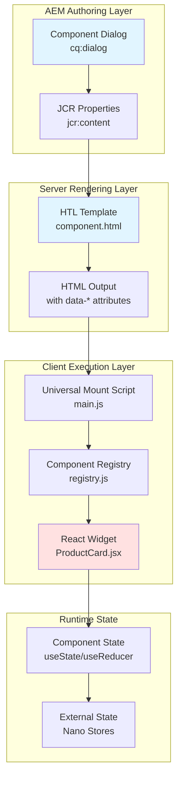

#### Implementation Flow

**Step 1: AEM Component Structure**

```
/apps/myproject/components/react-product-card/
├── .content.xml              # Component definition
├── _cq_dialog.xml            # Author dialog
├── react-product-card.html   # HTL template
└── clientlib/                # Client library
    ├── css.txt
    ├── js.txt
    └── css/
        └── styles.css
```

**Step 2: Component Dialog (_cq_dialog.xml)**

```xml
<?xml version="1.0" encoding="UTF-8"?>
<jcr:root xmlns:jcr="http://www.jcp.org/jcr/1.0"
          xmlns:cq="http://www.day.com/jcr/cq/1.0"
          xmlns:granite="http://www.adobe.com/jcr/granite/1.0"
    jcr:primaryType="nt:unstructured"
    jcr:title="React Product Card Configuration">
    <content jcr:primaryType="nt:unstructured">
        <items jcr:primaryType="nt:unstructured">
            <productId
                jcr:primaryType="nt:unstructured"
                sling:resourceType="granite/ui/components/coral/foundation/form/textfield"
                fieldLabel="Product ID"
                name="./productId"/>
            <displayMode
                jcr:primaryType="nt:unstructured"
                sling:resourceType="granite/ui/components/coral/foundation/form/select"
                fieldLabel="Display Mode"
                name="./displayMode">
                <items jcr:primaryType="nt:unstructured">
                    <compact value="compact" text="Compact"/>
                    <detailed value="detailed" text="Detailed"/>
                </items>
            </displayMode>
        </items>
    </content>
</jcr:root>
```

**Step 3: HTL Template (react-product-card.html)**

```html
<sly data-sly-use.clientLib="/libs/granite/sightly/templates/clientlib.html">
    
    <!-- Include React runtime clientlib -->
    <sly data-sly-call="${clientLib.js @ categories='myproject.react-runtime'}"/>
    
    <!-- React mount point with configuration -->
    <div class="react-widget"
         data-component="ProductCard"
         data-props="${properties @ context='scriptString'}"
         data-sly-test="${properties.productId}">
        
        <!-- Optional: Skeleton loader for better UX -->
        <div class="widget-skeleton">
            <div class="skeleton-image"></div>
            <div class="skeleton-text"></div>
            <div class="skeleton-text short"></div>
        </div>
    </div>
    
    <!-- Fallback for missing configuration -->
    <div data-sly-test="${!properties.productId}" class="cmp-placeholder">
        <p>Please configure the Product Card component.</p>
    </div>
    
</sly>
```

**Step 4: Configuration Data Flow**

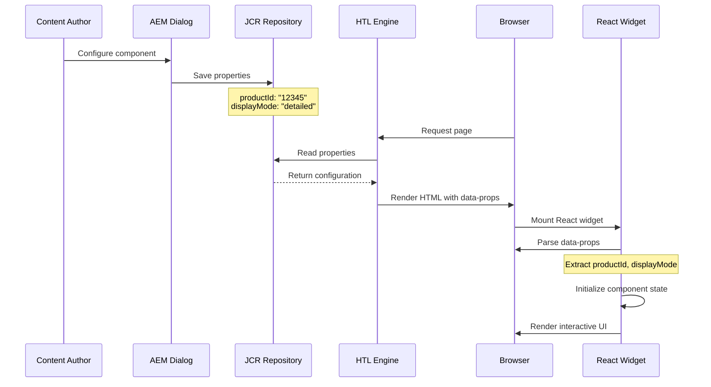

---

## 3. Multi-Root Mounting Strategy (Primary Approach)

### 3.1 Strategy Overview

**Definition**: The Multi-Root Mounting Strategy creates independent React application instances for each widget on a page, with each instance managing its own virtual DOM tree and lifecycle.

**Core Concept**: Instead of one React root controlling the entire page (SPA pattern), we create multiple isolated roots at specific DOM locations marked by the server-rendered HTML.

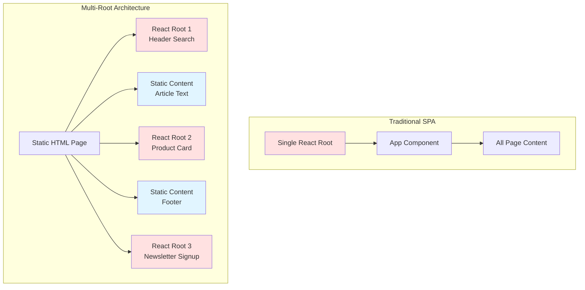

**Why This Approach Was Selected**:

1. **Fault Isolation**: If one widget crashes, others continue functioning
2. **Lazy Loading**: Each widget can load its JavaScript independently
3. **Performance**: Only hydrate widgets that are visible or needed
4. **Simplicity**: No complex routing or state synchronization required
5. **AEM Compatibility**: Works naturally with AEM's component-based architecture

### 3.2 Architectural Components

#### Mounting Mechanism

**Component Discovery Process**:

```javascript
// Mount script executed on DOMContentLoaded
function initializeReactWidgets() {
    // Query all React widget containers
    const widgets = document.querySelectorAll('[data-react-component]');
    
    widgets.forEach(container => {
        const componentName = container.getAttribute('data-react-component');
        const propsJson = container.getAttribute('data-props');
        
        // Create isolated root for each widget
        mountWidget(container, componentName, propsJson);
    });
}
```

**Root Creation and Isolation**:

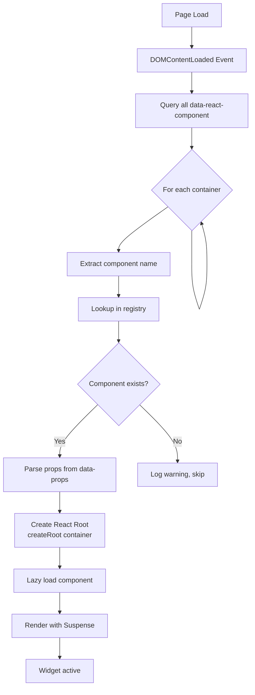

**Root Identification Pattern**:

```html
<!-- Pattern 1: Class-based selection -->
<div class="react-widget" 
     data-component="ProductCard"
     data-props='{"id": 123}'>
</div>

<!-- Pattern 2: ID-based for unique widgets -->
<div id="main-search"
     data-component="SearchAutocomplete"
     data-props='{"endpoint": "/api/search"}'>
</div>

<!-- Pattern 3: Script tag for large configs -->
<div class="react-widget"
     data-component="ComplexChart"
     data-source="chart-data-1">
</div>
<script type="application/json" id="chart-data-1">
{
  "chartData": [...],
  "config": {...}
}
</script>
```

#### Data Flow Architecture

**Configuration Flow from AEM to React**:

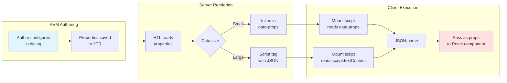

**Data Attribute Patterns**:

```javascript
// Simple configuration (< 1KB)
<div data-component="NewsletterSignup"
     data-props='{"variant": "sidebar", "theme": "dark"}'>
</div>

// Complex configuration with server data
<div data-component="UserDashboard"
     data-props='<%
        JSONObject props = new JSONObject();
        props.put("userId", currentUser.getId());
        props.put("permissions", currentUser.getPermissions());
        props.put("preferences", currentUser.getPreferences());
        out.print(props.toString());
     %>'>
</div>
```

**Props Injection Security**:

```java
// Sling Model approach for secure prop generation
@Model(adaptables = Resource.class)
public class ReactWidgetModel {
    
    @Inject
    private Resource resource;
    
    public String getPropsJson() {
        JSONObject props = new JSONObject();
        
        // Sanitize and escape all user input
        ValueMap properties = resource.getValueMap();
        props.put("title", XSSProtection.escape(properties.get("title", "")));
        props.put("productId", properties.get("productId", 0));
        
        return props.toString();
    }
}
```

#### Lifecycle Management

**Component Initialization Sequence**:

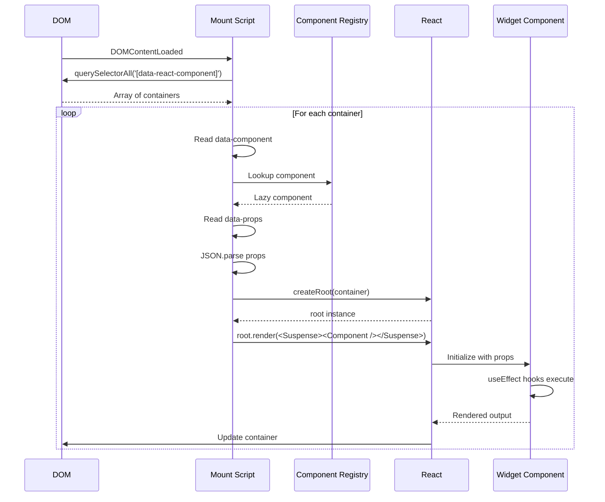

**Cleanup and Unmounting**:

Critical for single-page navigation frameworks (Turbo, Barba.js):

```javascript
// Track all active roots
const activeRoots = new Map();

function mountWidget(container, componentName, props) {
    const root = createRoot(container);
    activeRoots.set(container, root);
    
    root.render(
        <React.StrictMode>
            <Suspense fallback={<WidgetSkeleton />}>
                <Component {...props} />
            </Suspense>
        </React.StrictMode>
    );
}

// Cleanup before page transition
function unmountAllWidgets() {
    activeRoots.forEach((root, container) => {
        root.unmount(); // Triggers all useEffect cleanup functions
    });
    activeRoots.clear();
}

// Hook into navigation framework
document.addEventListener('turbo:before-cache', unmountAllWidgets);
document.addEventListener('turbo:load', initializeReactWidgets);
```

**Memory Management**:

```javascript
// Widget component with proper cleanup
function ProductCard({ productId }) {
    const [data, setData] = useState(null);
    
    useEffect(() => {
        const abortController = new AbortController();
        
        // Fetch product data
        fetch(`/api/product/${productId}`, {
            signal: abortController.signal
        })
            .then(res => res.json())
            .then(setData)
            .catch(err => {
                if (err.name !== 'AbortError') {
                    console.error(err);
                }
            });
        
        // Cleanup: abort ongoing requests
        return () => abortController.abort();
    }, [productId]);
    
    useEffect(() => {
        // Global event listener
        const handleCartUpdate = (e) => {
            // Handle event
        };
        
        window.addEventListener('cart:update', handleCartUpdate);
        
        // Cleanup: remove listener
        return () => window.removeEventListener('cart:update', handleCartUpdate);
    }, []);
    
    return <div>{/* Component JSX */}</div>;
}
```

### 3.3 Implementation Pattern

#### Complete Implementation Example

**1. Component Registry (registry.js)**

```javascript
import { lazy } from 'react';

/**
 * Centralized registry mapping component names to lazy-loaded modules
 * Add new widgets here as they are developed
 */
export const componentRegistry = {
    // E-commerce widgets
    'ProductCard': lazy(() => import('./widgets/ProductCard')),
    'ShoppingCart': lazy(() => import('./widgets/ShoppingCart')),
    'ProductSearch': lazy(() => import('./widgets/ProductSearch')),
    
    // Form widgets
    'ContactForm': lazy(() => import('./widgets/ContactForm')),
    'NewsletterSignup': lazy(() => import('./widgets/NewsletterSignup')),
    'CalculatorWidget': lazy(() => import('./widgets/CalculatorWidget')),
    
    // Content widgets
    'CommentsSection': lazy(() => import('./widgets/CommentsSection')),
    'RelatedArticles': lazy(() => import('./widgets/RelatedArticles')),
    'ShareButtons': lazy(() => import('./widgets/ShareButtons')),
    
    // Interactive elements
    'ImageGallery': lazy(() => import('./widgets/ImageGallery')),
    'VideoPlayer': lazy(() => import('./widgets/VideoPlayer')),
    'InteractiveChart': lazy(() => import('./widgets/InteractiveChart'))
};

/**
 * Get component from registry with validation
 */
export function getComponent(name) {
    const component = componentRegistry[name];
    
    if (!component) {
        console.error(`Component "${name}" not found in registry`);
        return null;
    }
    
    return component;
}
```

**2. Universal Mount Script (main.js)**

```javascript
import React, { Suspense } from 'react';
import { createRoot } from 'react-dom/client';
import { getComponent } from './registry';

// Skeleton component for loading state
const WidgetSkeleton = () => (
    <div className="widget-skeleton" aria-busy="true" aria-live="polite">
        <div className="skeleton-pulse"></div>
    </div>
);

// Error boundary for widget isolation
class WidgetErrorBoundary extends React.Component {
    constructor(props) {
        super(props);
        this.state = { hasError: false, error: null };
    }
    
    static getDerivedStateFromError(error) {
        return { hasError: true, error };
    }
    
    componentDidCatch(error, errorInfo) {
        console.error('Widget Error:', error, errorInfo);
        // Optional: Send to error tracking service
    }
    
    render() {
        if (this.state.hasError) {
            return (
                <div className="widget-error">
                    <p>Widget failed to load. Please refresh the page.</p>
                </div>
            );
        }
        
        return this.props.children;
    }
}

// Store active roots for cleanup
const activeRoots = new Map();

/**
 * Mount a single React widget
 */
function mountWidget(container) {
    const componentName = container.getAttribute('data-react-component');
    
    if (!componentName) {
        console.warn('Widget container missing data-react-component attribute', container);
        return;
    }
    
    // Get component from registry
    const Component = getComponent(componentName);
    if (!Component) return;
    
    // Parse props
    let props = {};
    try {
        const propsAttr = container.getAttribute('data-props');
        const propsSource = container.getAttribute('data-source');
        
        if (propsSource) {
            // Load props from script tag
            const scriptTag = document.getElementById(propsSource);
            if (scriptTag) {
                props = JSON.parse(scriptTag.textContent);
            }
        } else if (propsAttr) {
            // Load props from attribute
            props = JSON.parse(propsAttr);
        }
    } catch (error) {
        console.error(`Error parsing props for ${componentName}:`, error);
    }
    
    // Create root and render
    const root = createRoot(container);
    activeRoots.set(container, root);
    
    root.render(
        <React.StrictMode>
            <WidgetErrorBoundary>
                <Suspense fallback={<WidgetSkeleton />}>
                    <Component {...props} />
                </Suspense>
            </WidgetErrorBoundary>
        </React.StrictMode>
    );
    
    // Mark as initialized
    container.setAttribute('data-react-initialized', 'true');
}

/**
 * Initialize all React widgets on the page
 */
function initializeWidgets() {
    const containers = document.querySelectorAll(
        '[data-react-component]:not([data-react-initialized])'
    );
    
    containers.forEach(mountWidget);
}

/**
 * Unmount all active widgets (for SPA navigation)
 */
function unmountAllWidgets() {
    activeRoots.forEach((root) => {
        root.unmount();
    });
    activeRoots.clear();
}

// Initialize on page load
if (document.readyState === 'loading') {
    document.addEventListener('DOMContentLoaded', initializeWidgets);
} else {
    initializeWidgets();
}

// Export for programmatic use
export { initializeWidgets, unmountAllWidgets, mountWidget };
```

**3. AEM HTL Template Pattern**

```html
<!-- /apps/myproject/components/react-widget-wrapper/wrapper.html -->

<sly data-sly-use.clientLib="/libs/granite/sightly/templates/clientlib.html"
     data-sly-use.widget="com.myproject.core.models.ReactWidgetModel">
    
    <!-- Include React runtime (only once per page) -->
    <sly data-sly-call="${clientLib.js @ categories='myproject.react-runtime'}"/>
    <sly data-sly-call="${clientLib.css @ categories='myproject.react-runtime'}"/>
    
    <!-- Widget container -->
    <div class="cmp-react-widget"
         data-react-component="${widget.componentName}"
         data-props="${widget.propsJson @ context='unsafe'}"
         data-sly-attribute.data-source="${widget.largeDataId}">
        
        <!-- Server-rendered skeleton for better perceived performance -->
        <div class="widget-skeleton" data-sly-test="${widget.showSkeleton}">
            <div class="skeleton-header"></div>
            <div class="skeleton-content">
                <div class="skeleton-line"></div>
                <div class="skeleton-line short"></div>
            </div>
        </div>
        
        <!-- Noscript fallback -->
        <noscript>
            <div class="widget-fallback">
                ${widget.noScriptMessage @ context='html'}
            </div>
        </noscript>
    </div>
    
    <!-- Large data in separate script tag (if needed) -->
    <script type="application/json" 
            id="${widget.largeDataId}"
            data-sly-test="${widget.hasLargeData}">
        ${widget.largeDataJson @ context='unsafe'}
    </script>
    
</sly>
```

**4. Sling Model for Widget Configuration**

```java
package com.myproject.core.models;

import com.adobe.cq.export.json.ComponentExporter;
import org.apache.sling.api.resource.Resource;
import org.apache.sling.models.annotations.Model;
import org.apache.sling.models.annotations.injectorspecific.ValueMapValue;
import com.google.gson.Gson;
import com.google.gson.JsonObject;

@Model(adaptables = Resource.class)
public class ReactWidgetModel {
    
    @ValueMapValue
    private String componentName;
    
    @ValueMapValue
    private String configJson;
    
    private static final Gson gson = new Gson();
    
    public String getComponentName() {
        return componentName;
    }
    
    public String getPropsJson() {
        // Parse and sanitize configuration
        JsonObject props = gson.fromJson(configJson, JsonObject.class);
        
        // Add server-side context if needed
        props.addProperty("timestamp", System.currentTimeMillis());
        
        return gson.toJson(props);
    }
    
    public boolean hasLargeData() {
        // Check if data should be in separate script tag
        return getPropsJson().length() > 1000;
    }
    
    public String getLargeDataId() {
        return "widget-data-" + hashCode();
    }
    
    public String getNoScriptMessage() {
        return "This interactive widget requires JavaScript to function.";
    }
}
```

### 3.4 Coverage Analysis

#### Mapping Architecture to Requirements

| Requirement | How Multi-Root Strategy Addresses It |
|------------|--------------------------------------|
| **React widgets inside Sling/HTL pages** | ✅ Widgets mount into specific DOM nodes marked by HTL templates. Sling renders page structure, React enhances specific regions. |
| **AEM-style configuration** | ✅ AEM component wraps React widget. Dialog configuration flows through HTL to React via data attributes. Authors use familiar AEM dialogs. |
| **Mixed AEM and React components** | ✅ Static AEM components and React widgets coexist naturally. HTML document contains both server-rendered content and React mount points. |
| **Optimized build for clientlibs** | ✅ Build outputs separate chunks (vendor, runtime, widgets). Vite's `manualChunks` ensures React core is shared. Compatible with AEM clientlib structure. |
| **Component library reusability** | ✅ React widgets can import npm packages. Registry pattern allows mixing internal and external components. Standard React component interface. |
| **Selective activation per page** | ✅ HTL conditionally renders mount points. Widgets only load JS when present on page. Lazy loading ensures unused widgets don't download. |

#### Performance Optimization Opportunities

**Lazy Loading Strategy**:

```javascript
// Mount only when visible (Intersection Observer)
function mountWidgetWhenVisible(container) {
    const observer = new IntersectionObserver((entries) => {
        entries.forEach(entry => {
            if (entry.isIntersecting) {
                observer.disconnect();
                mountWidget(entry.target);
            }
        });
    }, {
        rootMargin: '200px' // Start loading 200px before visible
    });
    
    observer.observe(container);
}

// Mount on interaction
function mountWidgetOnInteraction(container) {
    const events = ['mouseover', 'touchstart', 'click'];
    
    const mount = () => {
        events.forEach(e => container.removeEventListener(e, mount));
        mountWidget(container);
    };
    
    events.forEach(e => container.addEventListener(e, mount, { once: true }));
}
```

**Conditional Loading in HTL**:

```html
<!-- Load widget only if user is authenticated -->
<div data-sly-test="${wcmmode.edit || currentPage.userLoggedIn}"
     data-react-component="UserDashboard"
     data-props="${userProps}">
</div>

<!-- Load widget only on specific page templates -->
<div data-sly-test="${currentPage.template == '/conf/myproject/templates/product-page'}"
     data-react-component="ProductComparison">
</div>
```

---

## 4. Alternative Approaches and Comparative Analysis

### 4.1 Portals Approach

#### Concept

React Portals allow rendering a component's output into a different part of the DOM tree while maintaining the component within the same React context.

```javascript
// Single React root at document level
const root = createRoot(document.getElementById('react-root'));

function App() {
    return (
        <>
            <MainApp />
            {/* Portal to header location */}
            {createPortal(
                <SearchWidget />,
                document.getElementById('header-search-slot')
            )}
            {/* Portal to sidebar */}
            {createPortal(
                <NewsletterWidget />,
                document.getElementById('sidebar-newsletter-slot')
            )}
        </>
    );
}
```

#### Architectural Difference

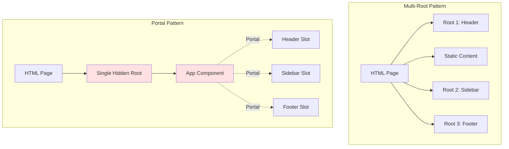

#### Advantages of Portals

1. **Shared Context**: All components can access same Context providers
2. **Event Bubbling**: React synthetic events bubble through portal hierarchy
3. **Single Root**: Simpler lifecycle management
4. **State Sharing**: Natural prop drilling or context for cross-widget communication

#### Disadvantages Compared to Multi-Root

| Aspect | Portals | Multi-Root | Winner |
|--------|---------|------------|--------|
| **Fault Isolation** | ❌ One error crashes all widgets | ✅ Widgets isolated | Multi-Root |
| **Lazy Loading** | ⚠️ Possible but complex | ✅ Natural per-widget loading | Multi-Root |
| **Bundle Size** | ❌ Must load all widget code | ✅ Load only needed widgets | Multi-Root |
| **AEM Integration** | ⚠️ Requires hidden root element | ✅ Natural HTML structure | Multi-Root |
| **State Sharing** | ✅ Easy via Context | ⚠️ Requires external solution | Portals |
| **Initial Setup** | ⚠️ More complex orchestration | ✅ Simple per-component mounting | Multi-Root |
| **Memory Leaks** | ⚠️ Single point of failure | ✅ Isolated cleanup | Multi-Root |
| **SEO** | ⚠️ Hidden root may confuse crawlers | ✅ Natural HTML structure | Multi-Root |

**Verdict for AEM Integration**: Multi-Root is superior because:
- Better aligns with AEM's component-based architecture
- Provides fault tolerance (critical for content sites)
- Enables true lazy loading (performance crucial)
- Simpler HTL integration (no hidden root required)
- Out-of-scope requirement: "No communication between components" makes Portals' main advantage irrelevant

### 4.2 Other Integration Patterns

#### Single-Page Application (SPA) with AEM SPA Editor

**Approach**: Full React takeover of the page using AEM's SPA Editor framework.

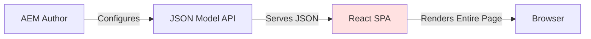

**Why Rejected**:
- ❌ Requires rewriting existing HTL templates to React
- ❌ Higher complexity: requires AEM SPA SDK
- ❌ All-or-nothing approach: can't incrementally adopt
- ❌ SEO challenges: requires server-side rendering setup
- ❌ Doesn't leverage AEM's strength in content rendering

**When to Use**: Greenfield projects with app-like interfaces (dashboards, configurators)

#### iframe Embedding

**Approach**: Embed React widgets in isolated iframe elements.

```html
<iframe src="/react-widgets/product-card.html?id=123"
        width="100%" height="400" frameborder="0">
</iframe>
```

**Disadvantages**:
- ❌ Poor performance: separate document, parsing overhead
- ❌ Styling challenges: iframe isolation complicates theming
- ❌ Communication overhead: postMessage API required
- ❌ Accessibility issues: screen readers struggle with iframes
- ❌ SEO: iframe content may not be indexed properly
- ❌ Layout: fixed height required or complex resize listeners

**When to Use**: Embedding third-party widgets with security isolation needs

#### Web Components

**Approach**: Package React widgets as Custom Elements.

```javascript
import React from 'react';
import ReactDOM from 'react-dom/client';
import ProductCard from './ProductCard';

class ProductCardElement extends HTMLElement {
    connectedCallback() {
        const props = JSON.parse(this.getAttribute('props'));
        const root = ReactDOM.createRoot(this);
        root.render(<ProductCard {...props} />);
    }
}

customElements.define('product-card', ProductCardElement);
```

```html
<!-- Usage in HTL -->
<product-card props='{"id": 123}'></product-card>
```

**Advantages**:
- ✅ Standards-based, framework-agnostic
- ✅ Encapsulation via Shadow DOM
- ✅ Native browser support (no additional runtime)

**Disadvantages**:
- ⚠️ Shadow DOM complicates global styling
- ⚠️ React doesn't officially support Web Components well
- ⚠️ Complexity in prop passing (strings only)
- ⚠️ Lifecycle management between Custom Elements and React

**Current Status**: Promising for future, but Multi-Root is more mature and better suited for current AEM integration needs.

---

## 5. Framework for React-AEM Integration

### 5.1 Necessity of a Custom Integration Framework

#### The Problem Without a Framework

**Scenario 1: Ad-hoc Integration**
```javascript
// Component A developer's approach
const root1 = ReactDOM.createRoot(document.getElementById('widget-1'));
root1.render(<Widget1 />);

// Component B developer's approach (different pattern)
document.querySelectorAll('.react-component').forEach(el => {
    const props = JSON.parse(el.dataset.config);
    ReactDOM.render(<Widget2 {...props} />, el);
});

// Component C developer's approach (yet another pattern)
window.mountReactWidget = function(id, props) {
    // Custom mounting logic
};
```

**Problems**:
- ❌ Inconsistent mounting patterns
- ❌ Duplicated boilerplate code
- ❌ Difficult to debug issues
- ❌ No standard error handling
- ❌ Memory leaks from unmounted widgets
- ❌ Performance inconsistencies

#### Framework Benefits

A dedicated integration framework provides:

### 5.2 Predictability and Standardization

**Consistent Component Interface**:

```javascript
// All widgets follow same contract
export default function MyWidget({ config, context }) {
    // config: AEM-authored configuration
    // context: Server-provided data (user, page info, etc.)
    
    return <div>{/* widget implementation */}</div>;
}

// Framework handles mounting automatically
```

**Standardized Configuration Pattern**:

```java
// Sling Model using framework base class
@Model(adaptables = Resource.class)
public class MyWidgetModel extends ReactWidgetModelBase {
    
    @ValueMapValue
    private String title;
    
    @Override
    protected JsonObject buildProps() {
        JsonObject props = super.buildProps();
        props.addProperty("title", title);
        return props;
    }
}
```

**Development Workflow Predictability**:

1. Create React component following framework interface
2. Register in component registry
3. Create AEM component using framework HTL template
4. Configure component dialog
5. Framework handles mounting, props, lifecycle

### 5.3 Long-term Maintainability

#### Centralized Integration Logic

```javascript
// Framework core (maintained by platform team)
class ReactAEMBridge {
    constructor(config) {
        this.registry = config.registry;
        this.errorHandler = config.errorHandler;
        this.performanceMonitor = config.performanceMonitor;
    }
    
    mount(container) {
        // Standardized mounting logic
        // Error boundaries
        // Performance tracking
        // Memory management
    }
    
    unmount(container) {
        // Cleanup logic
    }
}

// Application code (used by feature teams)
import { bridge } from '@myproject/react-aem-bridge';
bridge.registerComponent('ProductCard', ProductCard);
```

#### Version Management

```javascript
// Framework provides version compatibility layer
import { ComponentWrapper } from '@myproject/react-aem-bridge';

// Component automatically wrapped with version-specific logic
export default ComponentWrapper(MyComponent, {
    minReactVersion: '18.0.0',
    deprecatedProps: ['oldProp'],
    migrations: {
        '1.0.0': (props) => ({ ...props, newFormat: true })
    }
});
```

#### Centralized Updates

**Example: Adding Performance Monitoring**

```javascript
// Framework update (one file change)
class ReactAEMBridge {
    mount(container) {
        const startTime = performance.now();
        
        // ... existing mounting logic ...
        
        const endTime = performance.now();
        this.performanceMonitor.recordMount(
            container.dataset.component,
            endTime - startTime
        );
    }
}

// All widgets automatically get performance tracking
// No changes needed in 50+ widget files
```

### 5.4 Efficiency and Reusability

#### Shared Utility Functions

```javascript
// Framework provides common utilities
import { 
    useAEMContext,     // Access page/user context
    useAEMResource,    // Fetch AEM resources
    withAEMConfig,     // HOC for configuration
    AEMImage           // Optimized image component
} from '@myproject/react-aem-bridge';

function MyWidget({ productId }) {
    const context = useAEMContext(); // Framework-provided hook
    const product = useAEMResource(`/api/products/${productId}`);
    
    return (
        <div>
            <AEMImage src={product.image} alt={product.name} />
            <p>Viewing as: {context.user.name}</p>
        </div>
    );
}
```

#### Common Hooks Library

```javascript
// @myproject/react-aem-bridge/hooks

// Hook for AEM-aware client-side navigation
export function useAEMNavigation() {
    return {
        navigate: (path) => {
            // Check if WCM mode, handle accordingly
            // Track analytics
            // Update browser history
        }
    };
}

// Hook for dialog-driven configuration
export function useAEMConfig(defaults = {}) {
    const [config] = useState(() => {
        // Parse configuration from AEM component
        // Merge with defaults
        // Validate schema
    });
    return config;
}

// Hook for AEM Asset API
export function useAEMAsset(path) {
    // Fetch and cache AEM DAM assets
    // Return optimized renditions
}
```

#### Reusable Component Library

```javascript
// Framework-provided base components
import {
    AEMLink,           // Handles author vs publish links
    AEMRichText,       // Renders RTE content safely
    AEMForm,           // Integrates with AEM Forms
    AEMPersonalization // Handles targeting
} from '@myproject/react-aem-bridge/components';

function NewsArticle({ content }) {
    return (
        <article>
            <AEMRichText html={content.body} />
            <AEMPersonalization audienceId="newsletter-subscribers">
                <NewsletterCTA />
            </AEMPersonalization>
        </article>
    );
}
```

### 5.5 Framework Components

#### Architecture Overview

```mermaid
graph TB
    subgraph "Framework Core"
        A[Component Registry] --> B[Mount Orchestrator]
        B --> C[Lifecycle Manager]
        C --> D[Error Boundary]
        D --> E[Performance Monitor]
    end
    
    subgraph "Configuration Bridge"
        F[Props Parser] --> G[Schema Validator]
        G --> H[Type Coercion]
        H --> I[Context Injection]
    end
    
    subgraph "Utilities"
        J[Hooks Library] --> K[AEM API Client]
        K --> L[Cache Manager]
        L --> M[Event Bus]
    end
    
    subgraph "Dev Tools"
        N[Component Inspector] --> O[Config Debugger]
        O --> P[Performance Profiler]
    end