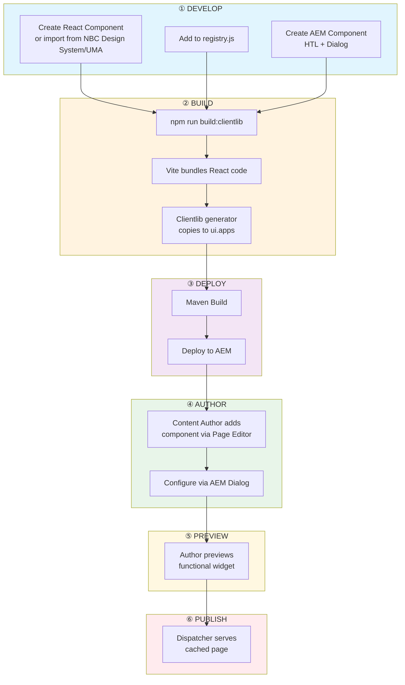

# React Integration Framework for AEM: Technical Design Document

> **Document Type:** POC Results & Architectural Recommendation  
> **Version:** 2.0  
> **Date:** December 2024  
> **Status:** Approved for Implementation

---

## Table of Contents

1. [Executive Summary](#1-executive-summary)
2. [Problem Statement](#2-problem-statement)
3. [The Core Challenge: ES Modules in AEM](#3-the-core-challenge-es-modules-in-aem)
4. [Solution Architecture](#4-solution-architecture)
5. [React Integration Framework](#5-react-integration-framework)
6. [Build Pipeline](#6-build-pipeline)
7. [Component Lifecycle Diagrams](#7-component-lifecycle-diagrams)
8. [Development Workflow](#8-development-workflow)
9. [Wrapper Component Pattern](#9-wrapper-component-pattern)
10. [Risks & Mitigations](#10-risks--mitigations)
11. [Decision Log](#11-decision-log)
12. [Limitations & Constraints](#12-limitations--constraints)
13. [References](#13-references)
14. [Glossary](#14-glossary)

---

## 1. Executive Summary

This document presents the findings from a Proof of Concept (POC) for integrating React.js into Adobe Experience Manager (AEM). The objective was to modernize frontend interactive capabilities while maintaining AEM's content management, performance, and SEO benefits.

### Key Recommendation

Adopt a **"Multi-Root Mounting Strategy"** (Islands Architecture) where:

- AEM remains the **primary host** for page structure and content
- React is **selectively mounted** as independent "islands" of interactivity
- A custom **React Integration Framework** orchestrates the bridge between AEM and React

### Technology Stack

| Layer | Technology | Purpose |
|-------|------------|---------|
| Build Tool | **Vite** | Modern ES Module bundler with code-splitting |
| UI Library | **React 18+** | Component-based interactive widgets |
| Language | **TypeScript** | Type-safe development with full IDE support |
| Delivery | **AEM Clientlibs** | Asset management and dependency handling |
| Bridge | **Custom Framework** | Discovers, loads, and mounts React components |

---

## 2. Problem Statement

### Current State

The platform relies on **Apache Sling** and **HTL** for server-side rendering, with interactivity handled via vanilla JavaScript and inline scripts.

### Challenges

| Challenge | Impact |
|-----------|--------|
| Complex state management | Error-prone "spaghetti code" for multi-step forms, dynamic filtering |
| Developer experience | Legacy stack slows feature development; modern talent expects React |
| Performance bottlenecks | Inefficient DOM manipulation degrades runtime performance |
| Low reusability | JavaScript logic tightly coupled to specific DOM structures |
| **Cross-platform component sharing** | Need to reuse components from NBC shared libraries (NBC Design System, UMA) across different platforms |

### Cross-Platform Component Reuse Requirement

A critical business requirement is the ability to **reuse React components from NBC shared libraries**:

- **NBC Design System** - Organization's design system package containing styled React components, tokens, and patterns
- **UMA (Unified Module Assembler)** - Internal React component library for cross-platform consistency

These libraries provide:

- ✅ Consistent UI/UX across multiple NBC platforms
- ✅ Pre-built, tested components (buttons, forms, cards, etc.)
- ✅ Design tokens (colors, typography, spacing)
- ✅ Accessibility compliance built-in

The integration framework must support importing and wrapping these shared components within AEM, acting as an **adapter layer** between AEM dialog configuration and the design system component expectations.

### POC Goals

✅ React components coexist within Sling-controlled pages  
✅ Widgets configurable via standard AEM Dialogs  
✅ Zero impact on critical rendering path of static content  
✅ Works with AEM authoring experience (Edit/Preview modes)  
✅ **Enable reuse of NBC Design System and UMA components**

---

## 3. The Core Challenge: ES Modules in AEM

### The Problem

Modern build tools (Vite, Rollup) output **ES Modules** with `import` statements:

```javascript
// Vite output (main.js)
import React from './vendor-abc123.js';
import { createRoot } from 'react-dom/client';
```

However, AEM Clientlibs generate **standard script tags**:

```html
<!-- AEM generates this -->
<script src="/etc.clientlibs/project/clientlibs/clientlib-react/js/main.js"></script>
```

**Result:** Browser throws `SyntaxError: Cannot use import statement outside a module`

### The Solution: Resource + Loader Pattern

We solve this with a two-part approach:

```
┌─────────────────────────────────────────────────────────────────┐
│                    Clientlib Structure                           │
├─────────────────────────────────────────────────────────────────┤
│  clientlib-react/                                                │
│  ├── js/                                                         │
│  │   └── loader.js          ← Standard JS (loaded by AEM)       │
│  ├── js.txt                 ← Points to loader.js                │
│  ├── resources/             ← ES Modules (served raw)           │
│  │   ├── main.js            ← Widget Engine entry point          │
│  │   ├── vendor-abc123.js   ← React/ReactDOM bundle              │
│  │   └── ProductCard-def456.js ← Lazy-loaded component          │
│  └── .content.xml                                                │
└─────────────────────────────────────────────────────────────────┘
```

| Part | Purpose |
|------|---------|
| **`loader.js`** | Standard JavaScript loaded by AEM. Dynamically injects `<script type="module">` |
| **`resources/`** | Vite output stored in AEM's resources folder. Served raw, preserving relative imports |

---

## 4. Solution Architecture

### Multi-Root Mounting Strategy (Islands Architecture)

```
┌─────────────────────────────────────────────────────────────────────┐
│                        AEM Page (HTL Rendered)                       │
├─────────────────────────────────────────────────────────────────────┤
│  ┌──────────────┐  ┌──────────────┐  ┌──────────────┐               │
│  │   Static     │  │   Static     │  │   Static     │               │
│  │   Content    │  │   Content    │  │   Content    │               │
│  │   (HTL)      │  │   (HTL)      │  │   (HTL)      │               │
│  └──────────────┘  └──────────────┘  └──────────────┘               │
│                                                                      │
│  ┌──────────────┐                    ┌──────────────┐               │
│  │ React Island │                    │ React Island │               │
│  │  (Widget 1)  │                    │  (Widget 2)  │               │
│  │  createRoot()│                    │  createRoot()│               │
│  └──────────────┘                    └──────────────┘               │
└─────────────────────────────────────────────────────────────────────┘
```

### Key Benefits

| Benefit | Description |
|---------|-------------|
| **SEO Preserved** | AEM renders full HTML; React enhances, not replaces |
| **Fault Isolation** | Each widget is an independent React root - one crash doesn't affect others |
| **Lazy Loading** | Widget code downloaded only when component exists on page |
| **Optimal Caching** | Vendor bundle (React core) separated from app code for long-term caching |
| **Native Authoring** | Works with standard AEM dialogs and Page Editor |

### Data Contract: AEM ↔ React

Communication between AEM and React occurs via **data attributes**. This decoupling ensures React components can be tested in isolation.

**AEM Component HTML Output (HTL):**

```html
<div 
    class="react-widget-container"
    data-widget-component="ProductCard" 
    data-props='{"productId":"123", "theme":"dark", "showPrice":true}'>
    <!-- Server-rendered skeleton for CLS optimization -->
    <div class="skeleton-loader">Loading Product...</div>
</div>
```

| Attribute | Purpose |
|-----------|---------|
| `data-widget-component` | Component name matching the registry key |
| `data-props` | JSON-serialized props from AEM Dialog or Sling Model |

---

## 5. React Integration Framework

The Integration Framework is the "glue" that connects AEM-rendered HTML to React applications. It consists of five core components working together.

### Framework Architecture Overview

```
┌─────────────────────────────────────────────────────────────────────┐
│                 React Integration Framework                          │
├─────────────────────────────────────────────────────────────────────┤
│                                                                      │
│  ┌─────────────┐    ┌─────────────┐    ┌─────────────┐              │
│  │  loader.js  │───►│  main.jsx   │───►│ registry.js │              │
│  │ (ESM Bridge)│    │(Widget Eng.)│    │ (Component  │              │
│  └─────────────┘    └──────┬──────┘    │   Map)      │              │
│                            │            └─────────────┘              │
│                            ▼                                         │
│  ┌─────────────────────────────────────────────────────────────┐    │
│  │                    React Components                          │    │
│  │   ┌──────────┐  ┌──────────┐  ┌──────────┐  ┌──────────┐    │    │
│  │   │ProductCard│  │Calculator│  │SearchBox │  │ Form... │    │    │
│  │   └──────────┘  └──────────┘  └──────────┘  └──────────┘    │    │
│  └─────────────────────────────────────────────────────────────┘    │
│                                                                      │
│  ┌─────────────────────────────────────────────────────────────┐    │
│  │  ErrorBoundary (Fault Isolation for Each Widget Root)        │    │
│  └─────────────────────────────────────────────────────────────┘    │
│                                                                      │
└─────────────────────────────────────────────────────────────────────┘
```

---

### 5.1 Loader Script (`loader.js`) - The ESM Bridge

**Purpose:** Bridges AEM's standard script loading with ES Modules.

**Location:** `ui.frontend/src/loader.js`

**What It Does:**

1. **Detects its own path** using `document.currentScript`
2. **Checks for widgets** on the page (skips loading if none found)
3. **Handles AEM URL formats** including versioned/minified URLs
4. **Injects ES Module script** with `<script type="module">`
5. **Loads CSS** from the resources folder
6. **Adds preload hints** for performance optimization

**Key Code (Simplified):**

```javascript
/**
 * React Widget Loader (ESM Bridge + CSS Loader)
 * Features: Widget detection, preload hints, versioned URL handling
 */
(function() {
  'use strict';
  
  // Configuration
  var CLIENTLIB_NAME = 'clientlib-react';
  var PROJECT_NAME = 'aemcs-nbc-sites';
  var WIDGET_SELECTOR = '[data-widget-component]';
  
  // Skip if no widgets exist (performance optimization)
  function hasWidgetsOnPage() {
    if (document.querySelector(WIDGET_SELECTOR)) return true;
    if (window.Granite && window.Granite.author) return true; // Always load in author
    return false;
  }
  
  function init() {
    if (!hasWidgetsOnPage()) {
      console.log('[React Loader] No widgets found, skipping load.');
      return;
    }
    
    var basePath = getClientlibBasePath();
    
    addPreloadHints(basePath);  // Performance optimization
    loadStyles(basePath);        // Inject CSS
    loadScript(basePath);        // Inject <script type="module">
  }
  
  init();
})();
```

---

### 5.2 Widget Engine (`main.tsx`) - The Orchestrator

**Purpose:** Discovers widget containers in the DOM and mounts React components.

**Location:** `ui.frontend/src/main.tsx`

**What It Does:**

1. **Scans DOM** for elements with `data-widget-component`
2. **Looks up components** in the registry
3. **Parses JSON props** from `data-props` attribute
4. **Detects WCM mode** (Edit vs Preview vs Published)
5. **Creates React roots** for each widget with Error Boundaries
6. **Handles cleanup** when DOM nodes are removed (memory leak prevention)
7. **Supports lazy hydration** via IntersectionObserver

**Key Code (Simplified):**

```tsx
import React, { Suspense } from 'react';
import { createRoot, Root } from 'react-dom/client';
import { registry } from './registry';
import type { WidgetContainer, RootEntry } from './types/widget.types';
import { ErrorBoundary } from './utils/ErrorBoundary';

const WIDGET_SELECTOR = '[data-widget-component]';
const activeRoots = new Map<WidgetContainer, RootEntry>();

function mountWidget(container: WidgetContainer): void {
  // Prevent double mounting
  if (activeRoots.has(container)) return;
  
  const componentName = container.dataset.widgetComponent;
  const Component = registry[componentName];
  
  if (!Component) {
    console.warn(`Component "${componentName}" not in registry.`);
    return;
  }
  
  // Parse props safely
  const props = JSON.parse(container.dataset.props || '{}') as Record<string, unknown>;
  
  // Create isolated React root
  const root = createRoot(container);
  root.render(
    <ErrorBoundary widgetName={componentName}>
      <Suspense fallback={<div>Loading...</div>}>
        <Component {...props} />
      </Suspense>
    </ErrorBoundary>
  );
  
  activeRoots.set(container, root);
}

// Auto-initialize on DOM ready
document.addEventListener('DOMContentLoaded', () => {
  document.querySelectorAll(WIDGET_SELECTOR).forEach(mountWidget);
});
```

---

### 5.3 Component Registry (`registry.ts`) - The Mapping

**Purpose:** Maps string names (from AEM HTML) to actual React components.

**Location:** `ui.frontend/src/registry.ts`

**What It Does:**

1. **Centralizes component registration**
2. **Enables code-splitting** via `React.lazy()`
3. **Provides predictable lookup** for the Widget Engine

**Code:**

```typescript
import { lazy } from 'react';
import type { WidgetRegistry } from './types/widget.types';

/**
 * Component Registry
 * Maps data-widget-component values to React components.
 * All components are lazy-loaded for optimal performance.
 */
export const registry: WidgetRegistry = {
  'ProductCard': lazy(() => import('./components/ProductCard')),
  'Calculator': lazy(() => import('./components/Calculator')),
  'SearchWidget': lazy(() => import('./components/SearchWidget')),
  'MultiStepForm': lazy(() => import('./components/MultiStepForm')),
};
```

---

### 5.4 Error Boundary - Fault Isolation

**Purpose:** Prevents one widget's error from crashing the entire page.

**Location:** `ui.frontend/src/utils/ErrorBoundary.tsx`

**Problem Solved:**

Without Error Boundaries, a JavaScript error in any React component would:

- Crash the entire React tree
- Leave users with a blank or broken page

With Error Boundaries:

- Each widget is wrapped in its own boundary
- Only the failing widget shows an error state
- Other widgets continue functioning normally

**Code:**

```tsx
import React, { Component, ErrorInfo, ReactNode } from 'react';

interface ErrorBoundaryProps {
  widgetName: string;
  children: ReactNode;
}

interface ErrorBoundaryState {
  hasError: boolean;
  error: Error | null;
}

export class ErrorBoundary extends Component<ErrorBoundaryProps, ErrorBoundaryState> {
  state: ErrorBoundaryState = { hasError: false, error: null };
  
  static getDerivedStateFromError(error: Error): ErrorBoundaryState {
    return { hasError: true, error };
  }
  
  componentDidCatch(error: Error, errorInfo: ErrorInfo): void {
    console.error(`[${this.props.widgetName}] Error:`, error, errorInfo);
    // Send to error tracking service (e.g., Sentry)
  }
  
  render(): ReactNode {
    if (this.state.hasError) {
      return (
        <div className="widget-error">
          <p>Something went wrong with this component.</p>
          <button onClick={() => this.setState({ hasError: false, error: null })}>
            Try Again
          </button>
        </div>
      );
    }
    return this.props.children;
  }
}
```

---

### 5.5 Naming Convention: AEM ↔ React Contract

The framework uses a strict **naming convention** to bridge AEM templates and React components:

| AEM Side | React Side | Example |
|----------|------------|---------|
| `data-widget-component` attribute | Registry key | `"ProductCard"` |
| `data-props` JSON attribute | Component props | `{"sku": "123"}` |
| HTL variable from Sling Model | Serialized JSON | `${model.propsJson}` |

**AEM HTL Template Example:**

```html
<sly data-sly-use.model="com.project.models.ProductCardModel">
  <div class="react-widget-container"
       data-widget-component="ProductCard"
       data-props="${model.propsJson}">
    <div class="skeleton-loader">Loading...</div>
  </div>
</sly>
```

**Sling Model Example:**

```java
@Model(adaptables = Resource.class)
public class ProductCardModel {
    
    @ValueMapValue
    private String productId;
    
    @ValueMapValue
    private String theme;
    
    public String getPropsJson() {
        // Convert authored values to JSON for React
        return new JSONObject()
            .put("productId", productId)
            .put("theme", theme)
            .toString();
    }
}
```

---

## 6. Build Pipeline

### 6.1 Vite - The Build Tool

**What is Vite?**

Vite is a modern JavaScript build tool that:

- Uses **native ES Modules** in development for instant server start
- Uses **Rollup** for production builds with tree-shaking
- Provides **code-splitting** out of the box

**Why Vite (not Webpack)?**

| Aspect | Vite | Webpack |
|--------|------|---------|
| Dev Server Start | Milliseconds | 30+ seconds |
| Hot Module Replacement | Instant | 1-2 seconds |
| Build Time | Fast (Rollup) | Slower |
| Configuration | Minimal | Complex |
| ES Module Support | Native | Requires setup |

**What We Configure in `vite.config.ts`:**

```typescript
import { defineConfig } from 'vite';
import react from '@vitejs/plugin-react';
import path from 'path';

export default defineConfig({
  plugins: [react()],
  
  // CRITICAL: Ensures dynamic imports use relative paths
  base: './',
  
  // Path aliases for cleaner imports
  resolve: {
    alias: {
      '@': path.resolve(__dirname, './src'),
      '@components': path.resolve(__dirname, './src/components'),
    },
  },
  
  build: {
    outDir: 'dist',
    manifest: true,
    cssCodeSplit: false,  // Single CSS file
    
    rollupOptions: {
      input: {
        main: path.resolve(__dirname, 'src/main.tsx'),
      },
      output: {
        format: 'es',
        
        // Vendor splitting for optimal caching
        manualChunks: {
          vendor: ['react', 'react-dom'],
        },
        
        // Predictable naming
        entryFileNames: '[name].js',
        chunkFileNames: '[name]-[hash].js',
      },
    },
  },
});
```

**Data Flow Through Vite:**

```
┌──────────────────────────────────────────────────────────────────────┐
│                        VITE BUILD PROCESS                            │
├──────────────────────────────────────────────────────────────────────┤
│                                                                       │
│   Source Files                    Transformations                     │
│   ┌─────────────┐                                                    │
│   │ main.tsx    │─┐                                                  │
│   ├─────────────┤ │    ┌─────────────┐    ┌─────────────────────┐    │
│   │ registry.ts │─┼───►│    Vite     │───►│   Output (dist/)    │    │
│   ├─────────────┤ │    │  + Rollup   │    │                     │    │
│   │ Components/ │─┘    │             │    │ • main.js           │    │
│   │   *.tsx     │      │ • TSX→JS    │    │ • vendor-[hash].js  │    │
│   └─────────────┘      │ • Bundling  │    │ • [Component].js    │    │
│   │ types/      │      │ • Splitting │    │ • assets/main.css   │    │
│   │ *.types.ts  │      │ • Minify    │    │ • manifest.json     │    │
│   ┌─────────────┐      │ • CSS       │    │                     │    │
│   │ styles/     │─────►│             │    └─────────────────────┘    │
│   │ main.css    │      └─────────────┘                               │
│   └─────────────┘                                                    │
│                                                                       │
└──────────────────────────────────────────────────────────────────────┘
```

---

### 6.2 AEM Clientlib Generator (`clientlib.config.js`)

**What is aem-clientlib-generator?**

A Node.js tool that:

- Copies build artifacts to AEM's clientlib folder structure
- Generates `.content.xml` with correct JCR properties
- Creates `js.txt` / `css.txt` manifests
- Handles the `resources` folder for raw ES Modules

**What We Configure:**

```javascript
const path = require('path');

const BUILD_DIR = path.join(__dirname, 'dist');
const STATIC_DIR = path.join(__dirname, 'src');
const CLIENTLIB_DIR = path.join(
  __dirname,
  '../ui.apps/src/main/content/jcr_root/apps/aemcs-nbc-sites/clientlibs'
);

module.exports = {
  clientLibRoot: CLIENTLIB_DIR,
  
  libs: [{
    name: 'clientlib-react',
    allowProxy: true,
    categories: ['aemcs-nbc-sites.react'],
    
    // IMPORTANT: Disable AEM's processing (Vite already optimized)
    jsProcessor: ['default:none', 'min:none'],
    cssProcessor: ['default:none', 'min:none'],
    
    assets: {
      // 1. Loader script → Standard 'js' folder (AEM loads this)
      js: {
        cwd: STATIC_DIR,
        files: ['loader.js'],
      },
      
      // 2. Vite output → 'resources' folder (served raw)
      resources: {
        cwd: BUILD_DIR,
        files: ['**/*'],
        flatten: false,
      },
    },
  }],
};
```

**How Vite and Clientlib Generator Connect:**

```
┌─────────────────────────────────────────────────────────────────────────┐
│                      BUILD & DEPLOY PIPELINE                              │
├─────────────────────────────────────────────────────────────────────────┤
│                                                                           │
│   ui.frontend/src/                                                        │
│   ├── main.jsx          ─┐                                               │
│   ├── registry.js        │    ┌────────────┐     ┌────────────────┐     │
│   ├── components/        ├───►│   Vite     │────►│   dist/        │     │
│   └── loader.js         ─┘    │   Build    │     │   (ES Modules) │     │
│                               └────────────┘     └───────┬────────┘     │
│                                                          │               │
│                                                          ▼               │
│                                              ┌────────────────────────┐  │
│   ui.frontend/src/loader.js ────────────────►│  aem-clientlib-        │  │
│                                              │  generator             │  │
│                                              └───────────┬────────────┘  │
│                                                          │               │
│                                                          ▼               │
│   ui.apps/.../clientlibs/clientlib-react/                                │
│   ├── js/loader.js       ← From src/loader.js                           │
│   ├── js.txt             ← Generated                                     │
│   ├── resources/         ← From dist/                                    │
│   │   ├── main.js                                                        │
│   │   ├── vendor-abc123.js                                               │
│   │   └── assets/main.css                                                │
│   └── .content.xml       ← Generated                                     │
│                                                                           │
└─────────────────────────────────────────────────────────────────────────┘
```

---

## 7. Component Lifecycle Diagrams

### 7.1 Build & Development Lifecycle



---

### 7.2 Runtime Component Lifecycle (User Request to Render)


---

### 7.3 Sequence Diagram


---

## 8. Development Workflow

### Adding a New React Component

**Step 1:** Create the React component with TypeScript

```
ui.frontend/src/components/MyWidget/
├── index.tsx
├── MyWidget.types.ts
└── MyWidget.module.css
```

**Step 2:** Register in `registry.ts`

```typescript
import type { WidgetRegistry } from './types/widget.types';

export const registry: WidgetRegistry = {
  // ... existing
  'MyWidget': lazy(() => import('./components/MyWidget')),
};
```

**Step 3:** Create AEM component

```
ui.apps/.../components/my-widget/
├── _cq_dialog/
│   └── .content.xml   # Author dialog
├── my-widget.html     # HTL template
└── .content.xml
```

**Step 4:** HTL template output

```html
<div class="react-widget-container"
     data-widget-component="MyWidget"
     data-props='${model.propsJson}'>
  <div class="skeleton-loader">Loading...</div>
</div>
```

**Step 5:** Build and deploy

```bash
cd ui.frontend
npm run build:clientlib
cd ..
mvn clean install -PautoInstallPackage
```

---

## 9. Wrapper Component Pattern

When integrating NBC Design System or UMA components within AEM, you create **wrapper components** that serve as adapters between AEM's dialog configuration and the design system component's props interface.

### Why Wrappers?

| Challenge | Solution |
|-----------|----------|
| AEM dialogs output JSON strings | Wrapper parses and transforms to typed props |
| Design system expects specific prop names | Wrapper maps AEM field names to DS prop names |
| Design system has required props | Wrapper provides defaults for optional AEM fields |
| Multiple DS components per widget | Wrapper composes components together |

### Example: NBC Button Wrapper

```tsx
// ui.frontend/src/components/NBCButton/index.tsx
import { Button, type ButtonProps } from '@nbc/design-system';
import type { BaseWidgetProps } from '../../types/widget.types';

type ButtonVariant = 'primary' | 'secondary' | 'ghost';
type ButtonSize = 'small' | 'medium' | 'large';

/**
 * AEM props received from data-props attribute
 */
interface NBCButtonProps extends BaseWidgetProps {
  buttonLabel: string;
  buttonVariant?: ButtonVariant;
  buttonLink?: string;
  buttonSize?: ButtonSize;
  openInNewTab?: boolean;
}

/**
 * AEM Wrapper for NBC Design System Button
 * 
 * AEM Dialog fields → Wrapper → NBC Design System props
 */
export default function NBCButton({
  buttonLabel,
  buttonVariant = 'primary',
  buttonLink,
  buttonSize = 'medium',
  openInNewTab = false,
  ...restProps
}: NBCButtonProps): JSX.Element {
  const handleClick = (): void => {
    if (buttonLink) {
      window.open(buttonLink, openInNewTab ? '_blank' : '_self');
    }
  };

  return (
    <Button
      variant={buttonVariant}
      size={buttonSize}
      onClick={handleClick}
      {...restProps}
    >
      {buttonLabel}
    </Button>
  );
}
```

### Example: Complex Card Wrapper

```tsx
// ui.frontend/src/components/NBCCard/index.tsx
import { Card, CardMedia, CardContent, Typography, Button } from '@nbc/design-system';
import type { BaseWidgetProps } from '../../types/widget.types';

type CardVariant = 'elevated' | 'outlined' | 'filled';

/**
 * AEM props for the Card wrapper component
 */
interface NBCCardProps extends BaseWidgetProps {
  title?: string;
  description?: string;
  imageUrl?: string;
  imagePath?: string;  // Could come from AEM DAM reference
  ctaLabel?: string;
  ctaLink?: string;
  cardVariant?: CardVariant;
}

/**
 * AEM Wrapper for NBC Design System Card
 * Composes multiple design system components into a single widget
 */
export default function NBCCard({
  title,
  description,
  imageUrl,
  imagePath,
  ctaLabel,
  ctaLink,
  cardVariant = 'elevated',
}: NBCCardProps): JSX.Element {
  // Handle both imageUrl (external) and imagePath (DAM)
  const resolvedImage = imagePath || imageUrl;

  return (
    <Card variant={cardVariant}>
      {resolvedImage && (
        <CardMedia
          image={resolvedImage}
          alt={title || 'Card image'}
        />
      )}
      <CardContent>
        {title && <Typography variant="h3">{title}</Typography>}
        {description && <Typography variant="body1">{description}</Typography>}
        {ctaLabel && ctaLink && (
          <Button variant="text" href={ctaLink}>
            {ctaLabel}
          </Button>
        )}
      </CardContent>
    </Card>
  );
}
```

### Registration

```typescript
// registry.ts
import { lazy } from 'react';
import type { WidgetRegistry } from './types/widget.types';

export const registry: WidgetRegistry = {
  'NBCButton': lazy(() => import('./components/NBCButton')),
  'NBCCard': lazy(() => import('./components/NBCCard')),
  // ... other wrappers
};
```

---

## 10. Risks & Mitigations

| Risk | Severity | Likelihood | Mitigation |
|------|----------|------------|------------|
| **React bundle size impacts Core Web Vitals** | High | Medium | Vendor splitting (React core cached separately), lazy loading per component, skip loading when no widgets exist on page |
| **Widget error crashes entire page** | High | Low | Each widget wrapped in `ErrorBoundary` for fault isolation; only affected widget fails |
| **NBC Design System version conflicts** | Medium | Medium | Pin exact versions in `package.json`, test DS upgrades in dev before deploying, maintain changelog of DS updates |
| **Memory leaks from unmounted widgets** | Medium | Medium | `MutationObserver` detects DOM removal and unmounts React roots; `WeakMap` for tracking roots prevents stale references |
| **AEM author edits break React widget** | Medium | Low | WCM mode detection renders placeholder in Edit mode; full widget only in Preview/Publish |
| **CORS issues with external APIs** | Medium | Low | Configure AEM Dispatcher to proxy API requests, or use relative paths for internal APIs |
| **Lazy-loaded chunk fails to load** | Low | Low | `Suspense` fallback shows loading state; `ErrorBoundary` catches module load errors |
| **Build tool (Vite) breaking changes** | Low | Low | Lock Vite version, test upgrades in isolation, maintain build configuration documentation |
| **Browser compatibility with ES Modules** | Low | Low | ES Modules supported in all modern browsers (Chrome 61+, Firefox 60+, Safari 10.1+, Edge 16+); no IE11 support |

### Risk Monitoring

- **Performance:** Monitor Lighthouse scores, Core Web Vitals in production
- **Errors:** Integrate with error tracking service (Sentry, DataDog) to capture widget failures
- **Bundle Size:** Set up CI alerts if JS bundle exceeds threshold (e.g., 100KB gzipped)

---

## 11. Decision Log

This section documents key architectural decisions made during the POC, including alternatives considered and rationale.

### Decision 1: Multi-Root Mounting vs. React Portals

| Aspect | React Portals | Multi-Root Mounting (Selected) |
|--------|---------------|-------------------------------|
| **Architecture** | Single React root, portal to multiple DOM nodes | Independent React root per widget |
| **Fault Isolation** | ❌ One error crashes all portals | ✅ Error contained to single widget |
| **Bundle Loading** | All components loaded upfront | ✅ Lazy load per-component chunks |
| **Complexity** | Higher (portal management) | ✅ Simpler (standard createRoot) |
| **DOM Events** | Events bubble through React tree (unexpected) | ✅ Events bubble through DOM tree |

**Decision:** Multi-Root Mounting for fault isolation and lazy loading benefits.

### Decision 2: Build Tool - Vite vs. Webpack

| Aspect | Webpack | Vite (Selected) |
|--------|---------|-----------------|
| **Dev Server Start** | 30-60 seconds (large projects) | ✅ <1 second (native ESM) |
| **HMR Speed** | 1-3 seconds | ✅ <100ms |
| **Configuration** | Complex, verbose | ✅ Minimal, convention-based |
| **ES Module Support** | Requires configuration | ✅ Native |
| **Production Build** | Webpack bundler | Rollup (mature, tree-shaking) |
| **AEM Archetype Default** | ✅ Included | Requires custom setup |

**Decision:** Vite for developer experience and modern ESM support, despite requiring custom AEM integration.

### Decision 3: ES Module Loading Strategy

| Approach | Description | Verdict |
|----------|-------------|---------|
| **Transpile to IIFE** | Convert ESM to browser-compatible format | ❌ Loses code-splitting benefits |
| **AEM SPA Editor** | Full SPA integration with AEM | ❌ Overkill for widget use case, complex setup |
| **Resource + Loader Pattern** | Standard JS loader injects `<script type="module">` | ✅ Preserves ESM benefits, minimal AEM changes |

**Decision:** Resource + Loader pattern balances ES Module benefits with AEM compatibility.

### Decision 4: Shared State Between Widgets

| Approach | Notes | Verdict |
|----------|-------|---------|
| **Global Redux Store** | Single store shared across all widgets | ❌ Tight coupling, defeats isolation |
| **Context per Widget** | Each widget has own context | ✅ Isolation maintained |
| **Event-Based Communication** | CustomEvents for rare cross-widget needs | ✅ Loose coupling when needed |

**Decision:** Widgets are isolated by default; use CustomEvents for rare cross-widget communication.

---

## 12. Limitations & Constraints

This architecture has intentional limitations. Understanding these helps set proper expectations.

### What This Architecture Cannot Do

| Limitation | Reason | Workaround |
|------------|--------|------------|
| **No Server-Side Rendering (SSR)** | Would require Node.js infrastructure; AEM handles initial render | AEM renders static skeleton/placeholder; React hydrates on client |
| **React cannot control `<head>`** | AEM owns SEO meta tags, title, canonical URLs | Use AEM for all SEO metadata; React manages only widget content |
| **No routing inside widgets** | Widgets are isolated; page navigation owned by AEM | For multi-view widgets, use internal state, not URL routing |
| **Initial hydration delay** | JavaScript must load before interactivity | Minimize with preload hints, lazy loading, vendor caching |
| **IE11 not supported** | ES Modules not supported in IE11 | IE11 end-of-life (June 2022); no modern support needed |
| **Authors must preview to test** | Edit mode shows placeholder only | By design to prevent edit overlay conflicts |
| **Widget state not persisted** | React state resets on page navigation | Use localStorage/sessionStorage if state persistence needed |
| **Complex global state is harder** | Widgets are independent roots | Design widgets to be self-contained; API data via props |

### Performance Trade-offs

| Trade-off | Impact | Mitigation |
|-----------|--------|------------|
| Additional JavaScript download | ~45KB (React core) + widget code | Vendor splitting, long-term caching, lazy loading |
| Time to Interactive (TTI) increased | +50-200ms depending on widget complexity | Preload hints, only load when widgets exist |
| Bundle per widget | Multiple HTTP requests for lazy chunks | HTTP/2 handles parallel requests efficiently |

### AEM Authoring Constraints

| Constraint | Reason |
|------------|--------|
| Widgets show placeholder in Edit mode | Prevents React interactivity from blocking AEM edit overlays |
| Props come only from `data-props` attribute | Consistent, testable data contract |
| Component name must match registry key exactly | Case-sensitive lookup; use consistent naming conventions |

---

## 13. References

### Official Documentation

| Resource | Link |
|----------|------|
| **React 18 createRoot API** | [react.dev/reference/react-dom/client/createRoot](https://react.dev/reference/react-dom/client/createRoot) |
| **React Error Boundaries** | [react.dev/reference/react/Component#catching-rendering-errors-with-an-error-boundary](https://react.dev/reference/react/Component#catching-rendering-errors-with-an-error-boundary) |
| **React.lazy and Suspense** | [react.dev/reference/react/lazy](https://react.dev/reference/react/lazy) |
| **Vite Documentation** | [vitejs.dev/guide/](https://vitejs.dev/guide/) |
| **Vite Build Configuration** | [vitejs.dev/guide/build.html](https://vitejs.dev/guide/build.html) |
| **AEM Client Libraries** | [experienceleague.adobe.com/docs/experience-manager-65/developing/introduction/clientlibs.html](https://experienceleague.adobe.com/docs/experience-manager-65/developing/introduction/clientlibs.html) |
| **AEM HTL Specification** | [experienceleague.adobe.com/docs/experience-manager-htl/using/getting-started/getting-started.html](https://experienceleague.adobe.com/docs/experience-manager-htl/using/getting-started/getting-started.html) |
| **AEM WCM Modes** | [experienceleague.adobe.com/docs/experience-manager-65/developing/components/components-basics.html](https://experienceleague.adobe.com/docs/experience-manager-65/developing/components/components-basics.html) |

### Architectural Patterns

| Resource | Link |
|----------|------|
| **Islands Architecture (Jason Miller)** | [jasonformat.com/islands-architecture/](https://jasonformat.com/islands-architecture/) |
| **Micro Frontends** | [martinfowler.com/articles/micro-frontends.html](https://martinfowler.com/articles/micro-frontends.html) |
| **Patterns.dev - Islands Architecture** | [patterns.dev/posts/islands-architecture](https://www.patterns.dev/posts/islands-architecture) |

### Tools & Libraries

| Resource | Link |
|----------|------|
| **aem-clientlib-generator** | [github.com/wcm-io-frontend/aem-clientlib-generator](https://github.com/wcm-io-frontend/aem-clientlib-generator) |
| **AEM Vite (alternative integration)** | [aemvite.dev](https://aemvite.dev/) |
| **Rollup (Vite's production bundler)** | [rollupjs.org](https://rollupjs.org/) |

---

## 14. Glossary

| Term | Definition |
|------|------------|
| **AEM** | Adobe Experience Manager - enterprise content management system |
| **Clientlib** | Client Library - AEM's mechanism for managing CSS/JS with dependencies |
| **Error Boundary** | React component that catches JavaScript errors in child components and displays a fallback UI |
| **HTL** | HTML Template Language - AEM's server-side templating (formerly Sightly) |
| **Hydration** | Process of attaching JavaScript event handlers to server-rendered HTML |
| **Islands Architecture** | Hybrid pattern: static HTML with interactive JavaScript "islands" |
| **Loader Script** | The `loader.js` file that bridges AEM's standard script loading with ES Modules |
| **Multi-Root Mounting** | Pattern where multiple independent React apps mount at specific DOM locations |
| **NBC Design System** | Organization's design system package containing styled React components, design tokens, and patterns for consistent UI/UX across NBC platforms |
| **Registry** | The `registry.ts` file that maps component names to React components with lazy loading |
| **Sling** | Apache Sling - RESTful web framework underlying AEM |
| **Tree-shaking** | Dead code elimination during build, removing unused exports |
| **TypeScript** | Typed superset of JavaScript that compiles to plain JavaScript, providing type safety and improved developer experience |
| **UMA** | Unified Module Assembler - NBC's internal React component library for cross-platform consistency |
| **Vendor Splitting** | Separating third-party libraries (React) into a separate bundle for optimal caching |
| **Vite** | Modern JavaScript/TypeScript build tool using native ES Modules and Rollup for production builds |
| **WCM Mode** | Web Content Management Mode - AEM's authoring state (edit/preview/disabled) |
| **Widget** | Self-contained React component providing interactive functionality within an AEM page |
| **Widget Engine** | The `main.tsx` module that discovers, mounts, and manages React widgets on the page |
| **Wrapper Component** | React component that adapts NBC Design System or UMA components for AEM consumption, transforming dialog props to component props |

---

## Conclusion

The **React Integration Framework** provides a robust, maintainable solution for adding modern interactivity to AEM pages. By using the **Multi-Root Mounting Strategy** with a **Vite-based build pipeline**, we achieve:

✅ **Best of both worlds:** AEM's SEO and authoring + React's interactivity  
✅ **Performance optimized:** Lazy loading, code splitting, vendor caching  
✅ **Developer friendly:** Modern tooling, clear conventions, fault isolation  
✅ **Author friendly:** Standard AEM dialogs, edit/preview support  
✅ **Cross-platform reuse:** NBC Design System and UMA components via wrapper pattern

This architecture is production-ready and scalable for enterprise AEM implementations.

---
